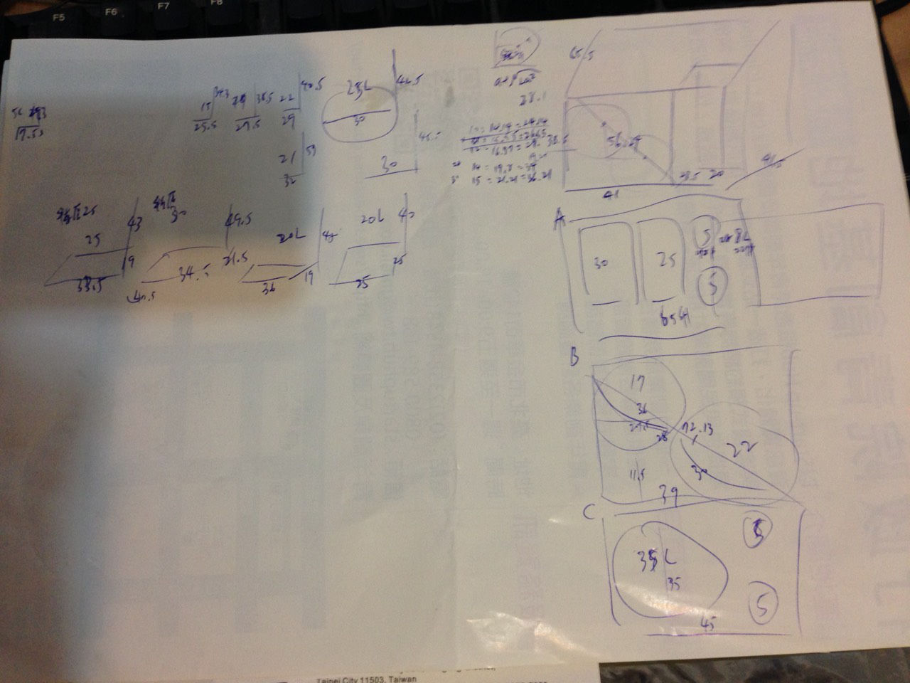

# 發酵溫控策略

由於每隻酵母都有最佳的工作溫度，控制發酵期的溫度可以確保酒體的品質與風味

發酵溫度過高：雜味變多，但速度加快

發酵溫度過低：有些風味會出不來，速度大幅變慢，但有時可以減少雜味

## 保冷箱＋冰塊

早晚各更新一次冰塊，就可以維持低溫。但是這個基本上沒有溫控可言。

優點：超低成本

缺點：每天早晚要顧，大型保冷箱很昂貴

**關於冷卻劑選擇**

結論：用一般容器裝水結冰就夠了，沒必要花錢買市面上的冰磚，尤其是那些號稱-16度C的

*   1.市售冰磚事實上與水的效果差不多，甚至很多都是水+色素而已，水本身已經是很優秀的媒介
>   冷媒事實上不太適合用在冰磚上，因為冷媒一般是設計在流動狀態，所以不能結冰，狀態變化是氣相與液相之間，而每單位體積的比熱事實上是低於水的。
*   2.有些人用飽和鹽巴降低冰點取得的熱容量事實上很有限 
*   3.真正吃熱量的主力事實上是結冰，而非水本身的比熱
>   所以許多號稱低溫才結冰的冰磚事實上反而是弱點：如果溫度不夠低，來不及結冰，效果會大打折扣。
>   
>   一般保冷劑有兩種吸收熱量的方法：物質本身的吸熱量（比熱）與形態變化的吸熱量（融化熱）。當冰塊從零下升溫到零度會吸一段熱，融化時又吸一段，融化後升回室溫再吸一段，所以我們可以計算出以下的吸熱能力（概算）
>   
>   一公克的水，冷凍到-16度，拿出來放到室溫20度的熱量
>   
>   純水：     融化熱334+水的比熱4.2x20+冰的比熱2.06x16 =450.96焦耳
>   
>   25%濃鹽水：融化熱334+濃鹽水比熱3.3x36              =452.8焦耳
>   
>   可以看到兩者幾乎沒啥差別，而融化熱佔了絕大多數，比熱事實上影響不大

總之可以把錢省下來惹，等真的需要的時候去買二手冰箱吧，4000$的飲料櫃可以放兩桶25公升好吸引人啊

## 冷水浴

SS發酵桶就是透過輸送冷水進去來調控發酵槽內溫度。可以用DIP來控制恆溫

優點：非常準確，只要冷水來源夠可以支援多個發酵槽，

缺點：隨時幫冷水槽加冰塊，挺累人的... 

或許可以跟冰櫃結合使用

[http://www.ssbrewtech.com/products/ftss-temp-control-for-7-gallon-bucket-chronical](http://www.ssbrewtech.com/products/ftss-temp-control-for-7-gallon-bucket-chronical)

實際看過，酒廠就是採用相同的方式運作，藉由控制冷水的進出來調節溫度

## DIY冷水浴

**討論**

https://www.facebook.com/groups/homebrew.tw/permalink/1255457394471566/

**[Vito Tai](https://www.facebook.com/vito.tai?fref=ufi)** 我研究這個一陣子了，交換一下心得；這個套件基本組成為：溫控、熱交換部件（盤管及fittings）、沈水pump。另外就是需要"冰水"。比較簡單的冰水來源就是冰箱冰保特瓶，不過比較理想的做法應該是直接從用冰箱。如果冰箱溫度接近零度，可以加一些防凍。溫控器應該大多數的溫控都可以用，小型的沈水pump很便宜，拍賣網上一堆。最難的部分應該是熱交換的部分。

**<u>[Vito Tai](https://www.facebook.com/vito.tai?fref=ufi)</u>** 熱交換的盤管據說其實不需要那麼長，即使是一個簡單的U型也可以。不過材質最好是不銹鋼的。另一個想法是jacketed，也就是"外包"，效率應該會比較差，但是材質還有fitting等等都不需要太講究，清潔維護也比較容易。我查過有人用軟管，也取得不錯的效果。

**[Vito Tai](https://www.facebook.com/vito.tai?fref=ufi)** 漏掉了保溫的部分，這部分如果做得好，系統效能會好很多。我看網路上有人說他用homedepot的隔熱綿，效果比那種潛水布料好。

**[Vito Tai](https://www.facebook.com/vito.tai?fref=ufi)** 另外，如果要用一個放冰水的水箱，支援多個發酵桶，可能需要考慮不用沈水的pump，因為水箱可能很難塞得下多個沈水馬達（我理想是4個）。而且考慮到水箱放在冰箱內，走管線出來，如果一個發酵桶用一個沈水馬達，就要跑2倍的線，4個發酵桶就需要8條線，不是可行的方案。如果採用一個pump，另外用電控球閥（我不確定正式名稱），成本可能會拉高。

**[李坤洲](https://www.facebook.com/profile.php?id=100000208426500&fref=ufi)** 一個pump是可行

你出去的管路並聯

用電磁閥控制

**[Vito Tai](https://www.facebook.com/vito.tai?fref=ufi)** 有想過，只是不熟電磁閥，而且似乎還要考慮pump的流量水壓；比方說，4路全開時似乎需要大一點的流量，而只開一路時，反而要考慮電磁閥的耐壓上限。想起來好像比較複雜一點。

**[Vito Tai](https://www.facebook.com/vito.tai?fref=ufi)** 溫控的部分最容易了，其實我手上剛好有一些多餘料件，有搞出一個可能同時控制4路的溫控器，是我目前唯一的進度...

**設計**

在冰箱恆溫，然後持續出水循環

*   優點：最簡單
*   缺點：大家溫度都一樣（或許可以用流量來改變溫度？）
*   疑點：水本身的比熱是否足以抵銷冰箱本身的溫度波動？

冰箱低溫，然後靠電磁閥循環控溫

*   香港酒廠採用此種方式控制

*   優點：電磁閥構造簡單
*   缺點：要另外處理供水問題
*   疑點：電磁閥的耐壓程度

冰箱低溫，然後靠泵浦循環控溫

*   優點：控制簡單
*   缺點：一堆泵浦，費用、噪音、體積都比較差，冰箱上還要打一堆洞

## 制冷片恆溫

優點：無起停限制，可以做到很細部的溫控，部分可靠電壓反轉來進行加熱

缺點：耗電量是壓縮機的十倍，壽命存疑

## 冰箱

最省事的幹法，但是要留意溫度控制的方式

**種類**

飲料櫃：最簡便的選擇，不用改溫控，還有玻璃可以從外面看清楚。要留意層板承重，價格最高

冷凍櫃：買個冰箱之音就可以做好基本溫控了。不錯的選擇，價格144公升新品約六千含運，300公升約一萬多

<s>一般冰箱：不是很建議，因為同時有冷凍櫃跟冷藏櫃，改裝起來很討厭</s>

<s>小冰箱：不要用，由於底部的壓縮機會佔掉空間，桶子會放不進去</s>

又分成臥式跟立式，臥式的優點是溫度不容易逸散，比較省電。立式的優點是濕氣容易散掉，不容易發霉

**注意事項**

空間：先確認家裡有空間放，量好尺寸

預估要擺放的數量：多少桶？什麼樣的桶子？預留的空間有多少？

溫控準確度：只要上下五度就好，還是希望很準確就是指定溫度？

家人：先跟家人協商好，免得到時候連人帶酒一起被趕進去關

千萬不要在發酵中把頭伸進冷凍櫃裡面聞香，裡面大量的CO2可是會把人嗆昏的

**儲放容量**

記得底下壓縮機會佔一塊空間，這個大小可能要現場看才知道。

建議選擇方形發酵桶（食品級塑膠），節省空間增加擺放數量。

如果堅持用不鏽鋼桶或玻璃桶，這些都是圓形的，會有很多浪費的空間出現。請善用高中物理來計算可擺放桶數。

考慮堆疊的話，就不能用一般水封（無法堆疊且浪費空間），而要用管子排氣。

可以上淘寶找適合的發酵

我的144L冷凍櫃的空間是 壓縮機底38.5*41cm*高28.5+41.5cm，壓縮機以上38.5*61*高41.5

最終選擇三桶25L

**溫度控制**

由於冷凍櫃的溫控本來就是溫度到了就對壓縮機啟動、斷電，所以透過直接切斷外部電源來控制冰箱，理論上不會有太大問題。

唯一就是起停不要太頻繁，壓縮機可能會燒掉。這也注定了這種類型無法做到準確的溫度控制

冰箱知音，大陸的帶溫度控制電源供應器

[https://item.taobao.com/item.htm?spm=a1z0k.7385961.1997985097.d4918997.6l6gWI&id=37186639573&_u=41slnp4j6e91](https://item.taobao.com/item.htm?spm=a1z0k.7385961.1997985097.d4918997.6l6gWI&id=37186639573&_u=41slnp4j6e91) 

*   [開箱文] 溫度控制器XH-W2102
*   非常簡單易用的溫控器，左邊開始溫度，中間當前溫度，右邊停止溫度。基本上就是左邊溫度過了就開，開到右邊溫度過了停止。冰箱跟電鍋都測試過，效果簡單明瞭，值得使用。
*   除了一般溫控開關，他也支援定時起停（F-1）、定時關機(F-2)、定時開機(F-3)。
*   電壓通吃110-220，可支撐瓦數2200(220v)或1100(110v)的設備，內部結構採用10A繼電器，電路與焊接也ok，基本上對應一般冷凍櫃是ok的。
*   使用上要注意的是，溫度昇降在切斷電源後一般還會移動個幾度。以電鍋為例（空鍋只放少量水），我設定在65-67，實際溫度會在64.5-71之間擺動。這一點實際上還好：麥汁本身就會緩衝溫度變化，所以不用太擔心。
*   小缺點：國際插座沒有考慮到有分火線的插頭，差的時候要有一點點硬塞。
*   [https://www.facebook.com/groups/1575006752729316/permalink/1693572844206039/](https://www.facebook.com/groups/1575006752729316/permalink/1693572844206039/)

如果要求高精確的溫控，或許可以考慮搭配冷水浴

**修改冰箱原有之溫控旋鈕**

大致上不建議，因為很繁複

[http://www.homebrewtalk.com/showthread.php?t=249612](http://www.homebrewtalk.com/showthread.php?t=249612)

**價位**

二手雙門飲料櫃 6000~

上掀式冷凍櫃 新品7xxx$ 二手3000-4000$

二手玻璃單門大體上6500-10000之間，400-500升，有新舊之分，大多可放2-4桶

[http://24h.pchome.com.tw/prod/DPAC03-A74360277?q=/S/DPAC7A](http://24h.pchome.com.tw/prod/DPAC03-A74360277?q=/S/DPAC7A)  91升小冰箱 5490$

[https://www.facebook.com/groups/1614594375433014/permalink/1872965399595909/](https://www.facebook.com/groups/1614594375433014/permalink/1872965399595909/)  二手飲料櫃220V 3000-4000$

143L 冷凍櫃 6450$ [http://www.momoshop.com.tw/goods/GoodsDetail.jsp?i_code=2469701&str_category_code=2901800008&mdiv=2901800008&Area=DgrpCategory#](http://www.momoshop.com.tw/goods/GoodsDetail.jsp?i_code=2469701&str_category_code=2901800008&mdiv=2901800008&Area=DgrpCategory#)

200L超便宜 6392$ http://www.momoshop.com.tw/goods/GoodsDetail.jsp?i_code=3729026&str_category_code=2919101015&mdiv=2919101015&Area=DgrpCategory

## 地窖或水池

好野人或鄉間的專利

## 高溫發酵

部分酵母是適合高溫發酵的，尤其是來自澳洲的酵母。514就是經典款：26-32度

這當然就大幅侷限了可以釀的酒種

另外Saison也是溫度不高味道就不對的酒種