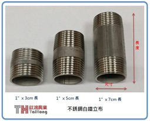
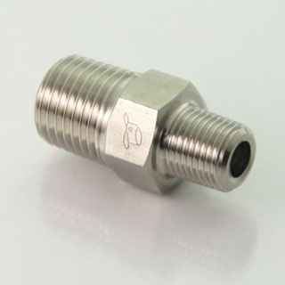
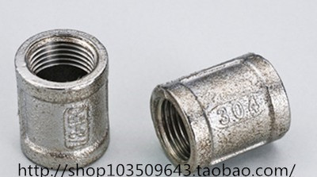
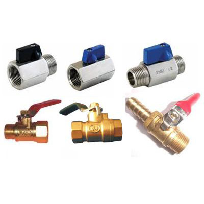
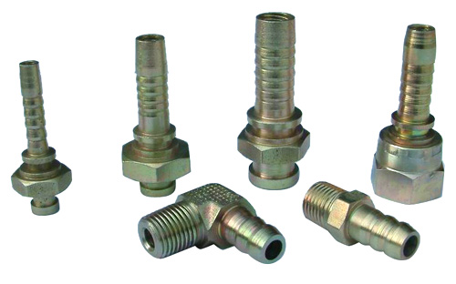
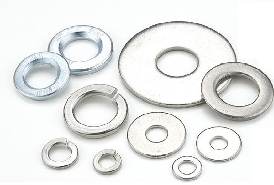

# 硬體改裝

## 常見名詞

**水管類**

管牙：特色是螺紋從深到淺，鎖螺帽時會越來越緊

立布、立卜：兩邊都是公頭的管子，協助連接兩個元件，或是延長（上下圖）

異徑：兩邊的頭尺寸不一樣（上圖）

管古：類似立布協助連接兩個元件（或延長），但是兩端都是母頭（下圖）

內絲：母頭

外絲、外牙：公頭

球閥、考克、凡兒：一個開關，裡面一般會是一顆可旋轉的金屬球所以叫球閥

軟管接頭（大陸稱寶塔頭）：用來連接水管、矽膠管的接頭

華司：金屬墊片

**電動**

泵浦：

## 該上哪買材料

大多數管子是要用來通過液體跟氣體的，所以一般水電行可能找不全你要的材料，推薦找空壓材料行

環河南路比較多，那邊空壓設備的店家很多

太原路上的話，推薦先去 聯成空油壓五金行 103台北市大同區華陰街119號

其次是 泉成五金有限公司 太原路30號

大家休假可去環河南路，或西門丁一帶傳統歺具行逛逛，煮鍋或各式濾網超多種，會多到不知選那種好。

## 改裝指引

**鍋子或桶子裝球閥**

*

[https://www.youtube.com/watch?v=ASkdxa-mdGc&feature=youtu.be](https://www.youtube.com/watch?v=ASkdxa-mdGc&feature=youtu.be)

**[許家維](https://www.facebook.com/profile.php?id=100000297023222&fref=ufi)** 會漏也沒關係，用了幾次就被麥芽塞住，就不漏囉 XD

**[Robin Wang](https://www.facebook.com/robin.wang168?fref=ufi)** 建議找到合適的假底時再鑽孔裝龍頭，不然有龍頭沒假底，超能力就大打折扣

**[王轟啤](https://www.facebook.com/profile.php?id=100010400491269&fref=ufi)** 墊片環怕被火燒到

**<u>[Robin Wang](https://www.facebook.com/robin.wang168?fref=ufi)</u>** 你用快速爐嗎？不然家用爐應該燒不到，我是 34cm,38cm 二鍋都有水龍頭，都試過燒不到

**[Robin Wang](https://www.facebook.com/robin.wang168?fref=ufi)** 如果真的在意，那就請人焊，不要用鎖的

**[許家維](https://www.facebook.com/profile.php?id=100000297023222&fref=ufi)** 快速爐有一塊凸出可以擋火，龍頭放在那一邊不會燒到

**[許家維](https://www.facebook.com/profile.php?id=100000297023222&fref=ufi)** 再不然也可以加個 heat shield ，就用一塊鐵片隔在球閥下

**玻璃發酵桶裝球閥**

別自己幫玻璃裝球閥，太累也風險太高了，買現成的吧，有人從大陸進貨了

[http://goods.ruten.com.tw/item/show?21545012704562](http://goods.ruten.com.tw/item/show?21545012704562)

**糖化桶裝球閥**

由於糖化桶多了一層保溫層，比較難搞，請參閱這裡

[多階段糖化與設備改裝](多階段糖化與設備改裝.md)

## 專案

**BrewPi**

[http://www.brewpi.com/](http://www.brewpi.com/)

藉由一個Rasperbby pi+arduino來做到：長期溫度記錄、0.1度的溫度控制

**冰箱改裝**

[http://www.brewpi.com/fridge-hacking-guide/](http://www.brewpi.com/fridge-hacking-guide/)