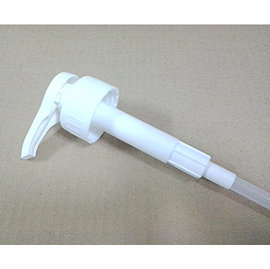
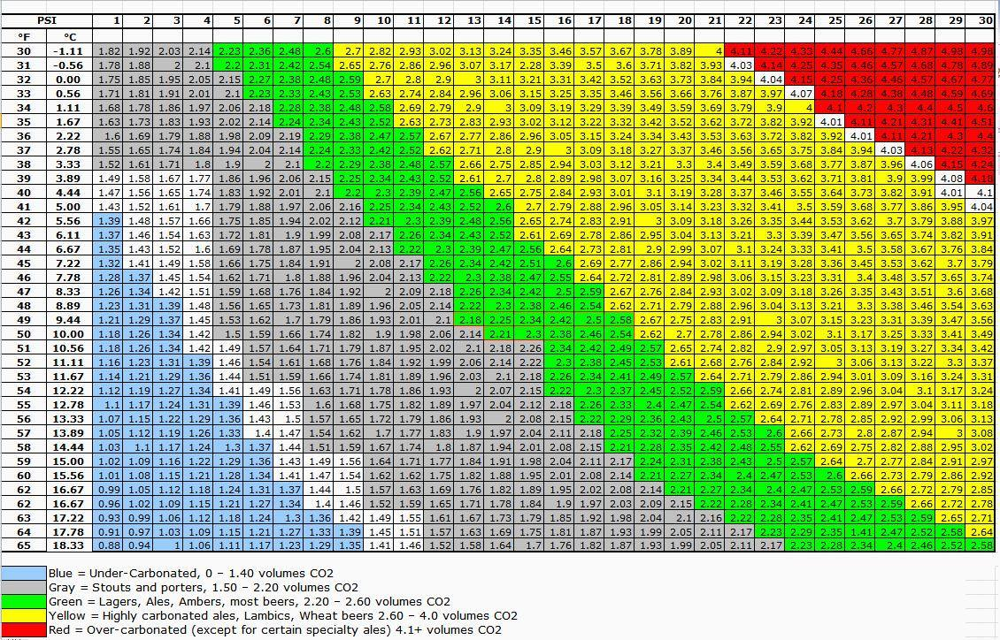

# 碳酸化

**目的**

為了讓啤酒擁有足夠的氣泡，喝起來更加清爽

不是每種酒都需要碳酸化，每種類型的含量也不一樣

一般來說碳酸化會避免改變味道，以免酒擺著味道變來變去（不穩定）

**時間**

碳酸化時間一般約兩週，不論自然發酵或強制充氣（兼顧Ale的熟成）

注意：**請不要以“二發”稱呼碳酸化**，因為確實有的酒種會需要二段（以上）發酵的操作，這個用語可能會誤導其他自釀者給出錯誤的建議。轉桶熟成階段也不稱為二發會比較明確。

*   我曾喝過一隻四段發酵的Stout, 酸啤酒一般也會有多段發酵

## 瓶內碳酸化（自然發酵）

**發酵糖選擇**

主要使用白糖、特砂、細沙、葡萄糖，加點水融化後煮沸消毒之後加入

也有人賣已經消毒的葡萄糖可以直接加

避免使用二砂（棕色結晶），因為會讓成品帶一股糖的酸味

避免使用蜂蜜，由於蜂蜜是複雜的混合物，難以預估發酵結果，已經有眾多受害者噴發了。另一方面，蜂蜜發酵可能會改變酒體氣味

其他糖類則以酵母容易食用、不改變味道、方便取得與消毒為前提選擇

*   看過中國使用咖啡用的糖包，微波消毒後整管倒入瓶內，似乎也是不錯的做法
*   澳洲Coppers有出一顆一顆的糖錠可以直接丟入瓶內，相當方便但也相當昂貴

**加入發酵糖的方法**

使用裝瓶桶：預估好一次裝瓶的量，煮好糖倒進去拌勻即可。須留意別讓他有太多暴露於空氣中的機會

使用定量滴管：定量滴管按一次會輸出固定的液體量（8 or 10cc），所以事先計算好濃度，把糖煮好倒進去，每一瓶按個一下兩下（根據濃度）就可以有充分的發酵糖了

定量滴管常見於調酒專用糖漿的瓶子，也可以到瓶罐材料行購買

[http://www.pcstore.com.tw/coffeecourt/M13759736.htm](http://www.pcstore.com.tw/coffeecourt/M13759736.htm)

**碳酸化的溫度**

[https://www.facebook.com/groups/homebrew.tw/permalink/1467957669888203/](https://www.facebook.com/groups/homebrew.tw/permalink/1467957669888203/)

**[Blackj Chao](https://www.facebook.com/blackj.chao?fref=ufi)** 可以的話最好還是全程冷藏，至少夏天三十幾度的室溫是絕對不適合保存酒的。但是需不需要放到四度那麼低？不需要，十到十五度剛好。

**酵母選擇**

一般會使用主發酵相同的酵母不另行添加，不過經過長時間熟成、低溫沉降等過程可能會發生酵母不足，碳酸化失敗的情況，此時可以考慮裝瓶前另行添加新酵母

一般會使用不會影響啤酒風味的酵母，例如S-04 <待確認>

*   商業酒也很常使用這個手法，碳酸化的酵母跟主發酵不同，意外增加了偷酵母的難度
*   是說拿麵包酵母做碳酸化不知道有沒有搞頭，論產氣麵包酵母是一流的，但怕留下麵包味ＸＤ

**殘糖充氣**

顧名思義，在啤酒發酵完全之前裝瓶，讓酵母吃完最後的糖產生的二氧化碳自然碳酸化

需要較準確的計算比重

因為不知道酵母的活性與可發酵糖的準確比例，所以容易發生碳酸化不足，或是噴發（甚至爆開）的問題

也有更簡潔的做法，透過keg發酵並調整洩壓閥讓過量的二氧化碳自然排除，參閱[壓力發酵](帶壓發酵與裝瓶.md) 

https://www.facebook.com/groups/homebrew.tw/permalink/1236474936369812/

## 人工充氣

基本上就是把現成的二氧化碳打到酒裡面，等待一段時間讓碳酸進入酒體，有點像汽水機那樣

食品級CO2是存在的，而且有[相關規範](http://www.mobile01.com/topicdetail.php?f=168&t=4224899&p=2#55844392)。[FDA 1040016680號公文](http://mohwlaw.mohw.gov.tw/Chi/FLAW/FLAWDAT01.asp?lsid=FL020106)事實上挺怪的，他表示Co2目前不以食品添加物管理，而是說“如果你符合[食品加工用二氧化碳衛生標準]的話，可以自主管理”。事實上這是比較嚴格的規範，因為僅允許“發酵法生產”且有檢驗標準，詳細食品添加物標準還在擬定中

不過，除非打蘇打水或是強制碳酸化，單純推酒的話是可以不用這麼搞剛就是.... 

TW Chu：食品級 CO2 HACCP 有賣的 達豐氣體

林洺呈 氣體，你可以加裝濾水 濾油 濾微生物的濾網，就可以跟食品接觸了

### 氣體行

[大華氣體行](http://mashup.com.tw/dahua/?page=product_list&group_id=5836) [02-25969531](tel:02-25969531)  對方表示並沒有證明文件

[宏理氣體](http://www.goodgas.com.tw/chuansheng/front/bin/home.phtml) 新北市永和區得和路47號 (02)2922-4611 醫療級氣體

[Dao Tan](https://www.facebook.com/tan56?fref=ufi) 我有賣 而且有食品級充氣廠配合...

13.5L鋁瓶4800$含Co2，調壓閥1000$

<https://www.facebook.com/groups/homebrew.tw/permalink/1236474936369812/>

## 溫度與壓力對照表

計算機 [http://www.brewersfriend.com/beer-priming-calculator/](http://www.brewersfriend.com/beer-priming-calculator/)

大致上不應該超過20psi, 30大概是極限。

## 二氧化碳建議含量

建議值="2.5" American Amber Ale: 2.3 - 2.8 vol

建議值="2.1" American Barleywine: 1.8 - 2.5 vol

建議值="2.3" American Brown Ale: 2.0 - 2.6 vol

建議值="2.4" American IPA: 2.2 - 2.7 vol

建議值="2.7" American Lager, Dark: 2.5 - 2.9 vol

建議值="2.7" American Lager, Light: 2.5 - 2.8 vol

建議值="2.7" American Lager, Premium: 2.5 - 2.8 vol

建議值="2.7" American Lager, Standard: 2.5 - 2.8 vol

建議值="2.5" American Pale Ale: 2.3 - 2.8 vol

建議值="2.6" American Pilsner: 2.5 - 2.7 vol

建議值="2.5" American Stout: 2.3 - 2.9 vol

建議值="2.5" Belgian Blonde Ale: 2.2 - 2.8 vol

建議值="2.7" Belgian Dubbel: 2.3 - 3.0 vol

建議值="2.9" Belgian Golden Strong Ale: 2.5 - 3.2 vol

建議值="2.5" Belgian Pale Ale: 2.1 - 2.7 vol

建議值="2.6" Belgian Specialty Ale: 2.1 - 2.9 vol

建議值="2.6" Belgian Strong Dark Ale: 2.3 - 2.9 vol

建議值="2.9" Belgian Tripel: 2.6 - 3.3 vol

建議值="2.6" Berliner Weiss: 2.4 - 2.9 vol

建議值="2.7" Bi&egrave;re de Garde: 2.3 - 2.9 vol

建議值="1.2" Bitter (Standard/Ordinary): 0.8 - 2.2 vol

建議值="1.2" Bitter (Special/Best/Premium): 0.8 - 2.1 vol

建議值="1.9" Bitter (Extra Special/Strong): 1.5 - 2.4 vol

建議值="2.6" Blonde Ale: 2.4 - 2.8 vol

建議值="2.4" Bock (Traditional): 2.2 - 2.7 vol

建議值="2.6" California Common: 2.4 - 2.8 vol

建議值="2.6" Cream Ale: 2.5 - 2.9 vol

建議值="2.4" Czech Pilsner: 2.3 - 2.6 vol

建議值="2.4" Dopplebock: 2.3 - 2.6 vol

建議值="2.0" Dry Stout: 1.8 - 2.5 vol

建議值="3.0" Dunkelweizen: 2.8 - 3.2 vol

建議值="2.4" Eisbock: 2.2 - 2.6 vol

建議值="2.0" English Barleywine: 1.6 - 2.5 vol

建議值="2.3" English Brown Ale (Northern): 2.2 - 2.7 vol

建議值="1.8" English Brown Ale (Southern): 1.3 - 2.3 vol

建議值="2.4" English IPA: 2.2 - 2.7 vol

建議值="1.9" English Pale Ale: 1.5 - 2.4 vol

建議值="2.4" Flanders Brown Ale/Oud Bruin: 2.2 - 2.8 vol

建議值="2.4" Flanders Red Ale: 2.2 - 2.7 vol

建議值="2.6" German Altbier: 2.1 - 3.1 vol

建議值="2.6" German Pilsner: 2.4 - 2.8 vol

建議值="2.7" Gueuze: 2.4 - 3.1 vol

建議值="2.4" Imperial IPA/Double IPA: 2.2 - 2.7 vol

建議值="2.2" Imperial Stout: 2.2 vol

建議值="2.3" Irish Red Ale: 2.1 - 2.6 vol

建議值="2.6" K&ouml;lsch: 2.4 - 2.8 vol

建議值="2.7" Lambic (Fruit): 2.4 - 3.1 vol

建議值="2.1" Lambic (Straight): 1.8 - 2.6 vol

建議值="2.4" Maibock/Helles Bock: 2.2 - 2.7 vol

建議值="1.8" Mild Ale: 1.3 - 2.3 vol

建議值="2.4" Munich Dunkel: 2.2 - 2.7 vol

建議值="2.5" Munich Helles: 2.3 - 2.7 vol

建議值="2.3" Oatmeal Stout: 1.9 - 2.5 vol

建議值="2.6" Oktoberfest/Marzan: 2.5 - 2.8 vol

建議值="2.2" Old Ale: 1.8 - 2.5 vol

建議值="2.1" Porter: 1.8 - 2.5 vol

建議值="2.8" Rauchbier: 2.4 - 2.8 vol

建議值="2.8" Roggenbier: 2.5 - 3.0 vol

建議值="2.9" Saison: 2.5 - 3.2 vol

建議值="2.4" Schwarzbier: 2.2 - 2.7 vol

建議值="1.9" Scottish Light 60/: 1.5 - 2.3 vol

建議值="1.9" Scottish Heavy 70/: 1.5 - 2.3 vol

建議值="2.0" Scottish Export 80/: 1.5 - 2.3 vol

建議值="2.1" Stout: 2.1 vol

建議值="2.0" Strong Scotch Ale: 1.6 - 2.4 vol

建議值="2.2" Sweet Stout: 2.0 - 2.4 vol

建議值="2.7" Weizen/Weissbier: 2.5 - 2.9 vol

建議值="2.6" Weizenbock: 2.4 - 2.9 vol

建議值="3.0" Witbier: 2.8 - 3.1 vol

建議值="2.5" Vienna Lager: 2.4 - 2.6 vol

非正解 : 數學很麻煩 ? 懶 (偶啦) 請依比例計算 19L

加麥(果)汁取代發酵糖 .... 依麥汁比重 偶大概用 19公升 瓶中發酵時需加入的麥汁量 

比重1.070約 0.94-1.41 公升

比重1.060約 1.41-1.64 公升 

比重1.050約 1.64-1.88 公升

比重1.040約 1.88-2.35 公升

比重1.030約 2.35-2.82 公升

比重1.020約 2.82-3.29 公升