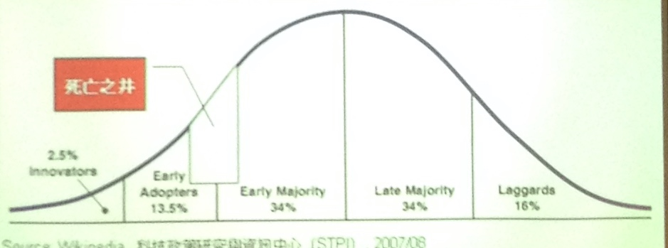

# 精釀的營運與市場分析

**講者**

古萬里 HoBrew家釀生活

視覺傳達設計、新一代策展、蕃薯藤公關、記者

每一杯啤酒後的故事

市場剖析

去年711, 金三, 精釀啤酒節很熱門，但實際已經開始八九年了

**商業v.s.精釀**

廣義：數量比較多v.s.原料精心釀造

狹義：美國工會對酒廠有定義

*   不能超過600萬桶
*   釀酒人與相關持股至少75%
*   必須是發酵酒類

**市場概況**

加州 精釀場增加20%

產值65億美金

350多萬桶

全世界2900多億美金

精釀啤酒只佔美國11%市場

台灣目前總啤酒產值27億

台啤70%

其他進口酒

精釀佔不到1%

去年新增20家經釀酒廠

藍海的原因？

**窘況**

*   稅金劣勢：自釀與海外課稅相同，26$，再怎麼高不超過10$，美國2$
*   台灣不產原料
*   推廣劣勢，民眾還不了解

**行動**

啤酒=日常生活，人們相聚的理由

分享與交流

自釀kit

實用設計、小空間、使用簡便

先推廣

用台灣故事釀台灣的酒

花蓮農村樂活地圖

比西里岸 台中阿美族部落

嘗試再現當時的氛圍與感受

募資嘖嘖 2周超標，出貨94套

產品生命週期圖

死亡之井

先行者困境

**對策**

*   實作課程

香港開課

節慶 季節限定 大吉大利

把分享投入酒標中

*   市場差異化，用山中的藥草

紅酒 產地、年份 => 故事

食安風險：

問題

怎麼跟世界上歷史悠久的眾多國家酒廠競爭？

台灣法規的限制，希望如何改變？

產地如何配合？

通路？