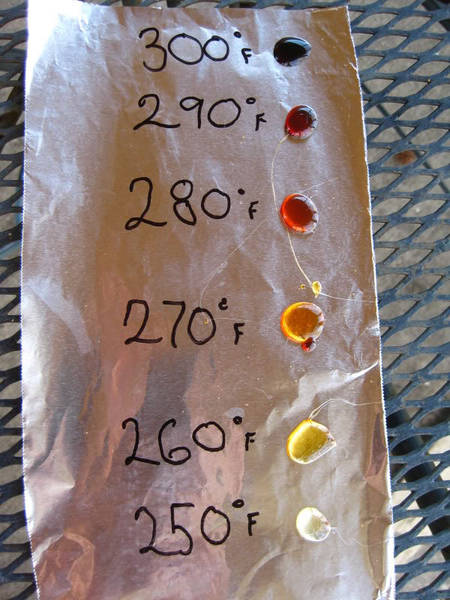

# 糖

[綜合討論](https://www.facebook.com/groups/homebrew.tw/permalink/606715779345734/?hc_location=ufi) 

[糖度測量與計算](基礎設備操作.md)

## 風味
ref: [酵母、酒花、麥芽、糖風味評量](酵母-酒花-麥芽-糖風味評量.md)

*   **120°C** 清澈的, 帶一點玫瑰紅的顏色. 這種糖漿甜且含有很少或者沒有任何特殊風味.
*   **127°C **帶點杏仁的顏色, 具有溫和的風味,感覺有點像水蜜桃和白葡萄汁的味道. 有些會具有更勝於溫和且帶有柔軟圓潤的香草風味
*   **132°C** 帶有杏仁色到淡琥珀色且開始有點紅色系的顏色出現, 溫和的焦糖風味並帶點水果甜的味道. 可能也會隱約帶有梅子和杏仁乾的味道.
*   **138°C **琥珀色. 強烈的焦糖味和明顯的荳蔻和梅子味道. 帶點烘烤的風味但感覺不到苦味.
*   **144°C **深沉的琥珀色和紅色. 葡萄乾和梅子是主要的味道, 且帶有少許麵包和咖啡的香氣. 有些甜酒的和淡淡的木頭味. 強烈且複雜的焦糖味為主軸.
*   **149°C **淡紅褐色, 比紅色再更偏棕色一點.  具有葡萄乾和無花果的味道代有一點溫和的苦味。有水果餡餅甜味, 沒有太複雜的焦糖味. 焦糖味已被烤麵包的焦味和苦甜味所取代. 比較豐富的味道但沒有290°F/144°C的糖漿那麼的複雜.
*   可以利用兩倍時間烹煮來增加風味，減少焦糖味

**製作Candy sugar **

https://sites.google.com/site/homebrewtw/homebrew_howto/homemade-candi-sugar

1.煮的時候會起大量泡沫，至少兩倍高，請準備夠大的鍋子跟玻璃容器

2.都是泡沫所以無法靠顏色判斷溫度，請準備高溫溫度計

3.色彩跟對應表似乎不大一致，或許是因為用二砂的關係？溫度量到165但是色彩感覺像132

4.相當粘鍋，夠濃稠，所以直接倒入瓶中就好，別用漏斗會黏得一塌糊塗

5.嘗試了調1.04的溶液去S-04發酵，幾乎無反應，放置一週有極度細微的氣泡

 https://www.facebook.com/groups/homebrew.tw/permalink/606715779345734/?hc_location=ufi

**製作生薑糖漿**

糖:水:生薑 10:10:1