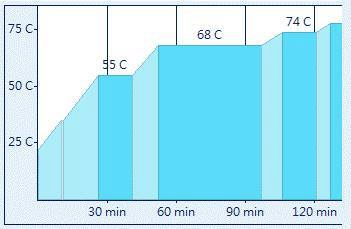

## 糖化效率建議

[https://www.facebook.com/groups/homebrew.tw/permalink/1302198036464168/?comment_id=1302234766460495&reply_comment_id=1302242443126394&notif_t=group_comment_reply&notif_id=1461569490342877](https://www.facebook.com/groups/homebrew.tw/permalink/1302198036464168/?comment_id=1302234766460495&reply_comment_id=1302242443126394&notif_t=group_comment_reply&notif_id=1461569490342877)

TW Chu 

85%糖化效率 25-55 25min, **55 30min**, 55-68 25min, **68 45min**, 68-74 10min, **74 15min**, total 120min

75%糖化效率 25-52 30min, **52 15min**, 52-63 25min, **63 45min**, 63-72 10min, **72 30min**, total 140min

## 水料比建議

高岩老師的書是3L:1kg，而用英制單位

我印象中(不知道從那來的)有人是建議1.25~1.5 qt/lb，3L:1kg換算約 1.44 qt/lb，也在範圍中。

但是，我根據Grainfather算出來的水料，高達1.6~1.8之間！

*   Grainfather的糖化水量計算方式是 (Grain weight in lb x 0.34) + 0.9 Gal
*   4.9kg => 10.7x0.34+0.9=4.572Gal=17.xL

田大也建議直火加熱的水可以多一點（也是我看不懂的單位～）

[http://blog.yam.com/james_tien/article/93034143](http://blog.yam.com/james_tien/article/93034143)

## 磨麥機

看過HBT上一篇提高糖化效率的文，文中的第一點就是：買一台磨麥機。據說大部分人買了磨麥機後，效率都可以從原本的50-60%提升10%以上。

## 糖化效率計算

by James Tien

[http://blog.yam.com/james_tien/article/142363737](http://blog.yam.com/james_tien/article/142363737)

北美的大酒廠內通常對Brewhouse Efficiency分成三級 >96% 非常好，93-96% 佳，<93% 不佳。一般精釀酒廠約為80-93%，而自釀可能會低到75%。釀酒廠內若使用mash filter取代lauter tun的狀況下，可以達到100%甚至超過的效率。

在業界裡頭和別人討論所用的名詞都是Brewhouse Efficiency(糖化效率)。

#### 公式一

*   Brewhouse Yield = % extract cg, db x (1 - % moisture) x Brewhouse Efficiency

    *   % extract cg, db 麥芽萃取率%，粗磨，無水乾重。需從麥芽報告上得到的實驗室釀造數據
    *   % moisture 麥芽水份含量。需從麥芽報告取得

#### 公式二

*   Brewhouse Efficiency = Brewhouse Yield / [% extract cg, db x (1 - % moisture)]

*   購買設備時通常會嚴格標註Brewhouse Efficiency，因此在初期計算才有辦法用以回推所需要的麥芽數量。

#### 公式三

*   Grain Weight = [volume of cool wort x (weight/volume) x SG x oP%] / Brewhouse Yield

*   Grain Weight 所需麥芽用量，若為多種麥芽，因為萃取率和水份不同，則需要跟據使用比例分別做計算
    *   Volume of cool wort 冷麥汁量，公升，源自煮沸完後冷卻的麥汁總量
    *   Weight/volume 比重計算，於20 oC 時1公升的水等於1公斤；所以測量麥汁比重要在20 oC或做溫度校正
    *   SG，Specific Gravity 比重
    *   oP%，Plato 糖度

自釀的情況下，我會用70-75%的效率做為麥芽用量的計算，然後跟據多次實際的操作情況再回來調整效率，以使計算用量更接近於實際。我的實務經驗，特殊麥芽用量<15%，糖化流程可見[糖化流程中的溫度](http://blog.yam.com/james_tien/article/76512068)，設備是簡單的塑膠桶配篩板做lauter tun，利用連續的灑水收集麥汁，一般情況下都可以達到約80%的效率。

#### 如果你的效率太低，那麼我建議你想一想

*   麥芽的品質和特殊麥芽使用比例
*   碾麥的品質
*   糖化流程是否跟據麥芽的狀態做適當調整
*   糖化用水的調整，鈣離子含量與pH
*   澄清麥汁收集的時間
*   測量用品是否準確

如果想要酒體清爽，殘糖含量低，發酵度高(酒精產量多)則需要進行Beta-Amylase的休止(Rest)。反之，若要做Stout、Bitter這類的酒，改用Alpha-Amylase休止。

如果我要做酒體清爽，口感比較乾的啤酒，我把40分鐘用在60-64 ℃休止。如果我要做酒體中等，喝起來質地不太像水的啤酒，那我把40分鐘用在68-72 ℃休止。如果要釀出介於兩者間酒體的酒，那麼我的40分鐘會用在64-68 ℃休止，甚至分為兩次休止，各為20分鐘。

