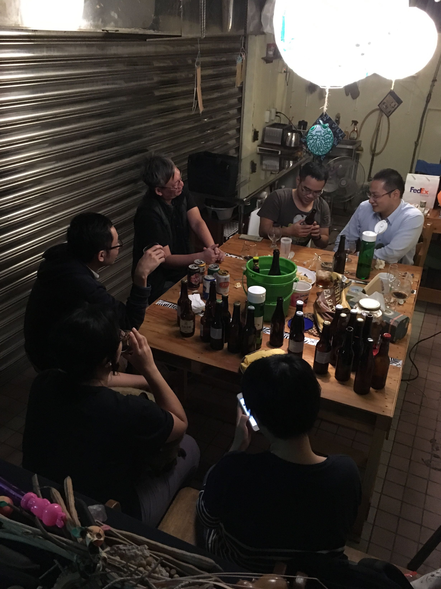
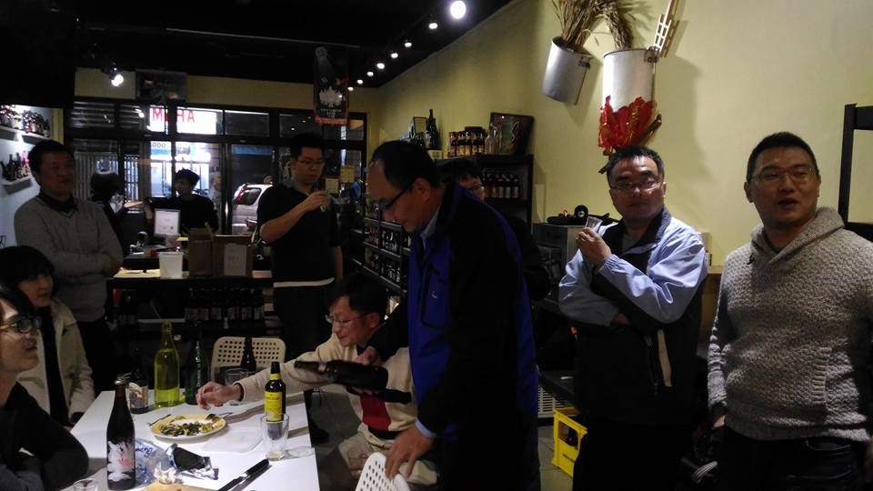
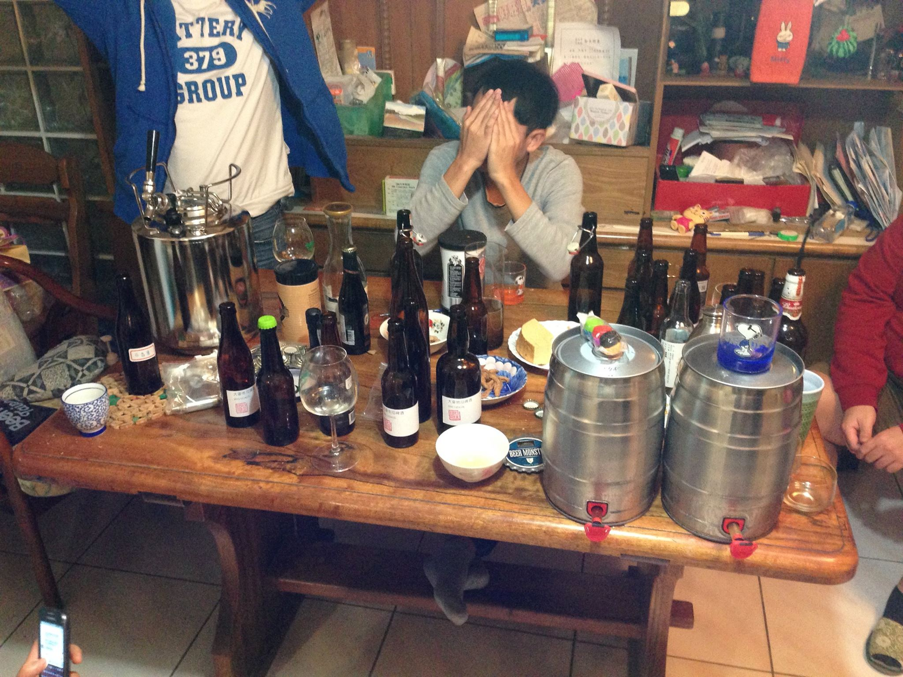

# 自釀分享會紀錄

## 20170115 橘蘋巢自釀聚會170115

## 20170107 橘蘋巢自釀聚會170107

## 20161104 橘蘋巢第二次自釀聚會

**自釀酒 15**

洛神花 直接奘瓶 （林洺呈）

*   洛神的感覺不強，酒體有點濁

洛神花 轉桶放冰箱裝瓶 （林洺呈）

*   基本上跟前面一樣，不過酒色變得比較深，沒有預期中澄清

青草茶 （林洺呈）

*   因為糖類被吃掉所以有一點藥水感

山苦瓜 （林洺呈）

鳳梨酒 （林洺呈）

*   很香甜的鳳梨味，喝下之後在喉嚨是很真實的鳳梨。倘若酒體再重一點點，應該會更加美味

薑汁啤酒 （林洺呈）

*   薑汁的香氣很棒，我覺得比我的薑汁啤酒感覺香氣真實多了，我喜歡這個香味

加乳酸菌的苦瓜啤酒（林洺呈）

*   很乾淨的酸味，有點酸白菜的感覺（乳酸菌的關係），但毫無臭味。不過也因此比較不會聯想到啤酒

加入特殊B 巧克力麥芽 煙燻麥芽 （蘇子傑）

*   蘇子傑：具有龍眼、培根的香氣 和 尾韻 主要是想要做出增加食慾的酒。 

T的為tripel B的為APA（蘇子傑）

*   就...很APA（笑

柚子（Arvin）這支中後段消失 完全無味 暫時懷疑是裝瓶時starsan 殘留過多

椪柑（Arvin）這支是2倍酒花的

*   很棒的香氣與甜味，椪柑的表現比我預期的還要棒
*   好像有一隻手滑兩倍酒花的...?

無名酒（小柯）

燕麥Stout（Ethen）

*   一開始是想作為缺陷樣本，因為這金鼎軒的麥芽放置play了半年ＱＱ
*   不過王鵬老師覺得這個沒有明顯的缺陷，頂多是尾韻消失的太快
*   因為風格正確，所以有參賽的潛力

巧克力Stout（Ethen）

*   失誤：煮花階段應該加入的巧克力沒加，所以後續才加入
*   成品一開始有一些水味，但是放到今天感覺漸漸消失

聖誕啤酒（Ethen）

*   還沒有到最佳熟成期，所以酒精感與厚度有一點不協調，預計聖誕節會到最佳狀態

**商業酒 14**
<undefined><li>**四隻放太久老化的臺灣艾爾啤酒，除了濃厚的版本真的不要放超過六個月 **</li></undefined>

桂圓黑啤

*   黑啤酒本身對於老化的對抗能力相對較強，還算是能夠入口喝起來不差

米啤酒

*   ＧＧ

地瓜

*   有發生乳酸感染，有奇怪的藥水味

柚子

*   ＧＧ
<undefined><li>**酸啤酒**</li></undefined>

The Bruery Terreux Gypsy tart 

*   據說可陳年四年，酸味較強，但是甜感與餘韻不錯

YPRES一戰紀念 2009雙桶陳黑酸啤 

*   味道相當豐富愉悅，價格也驚人
*   一開瓶就噴發
<undefined><li>**米凱樂辣椒啤酒**</li></undefined>

Chipotle Porter（小辣）

*   感覺不太到辣味，就是porter

Mexas Ranger（中辣）

*   事實上我覺得沒有很辣，還是荷蘭貓頭鷹的防狼噴霧那隻我最喜歡，超開胃
<undefined><li>**HONG KONG BEER CO**</li></undefined>

White pearl

*   莫名的有甘納豆風味的白啤酒，雖然也有老化但甘納豆風味仍在
<undefined><li>**Sean贊助的越南啤酒**</li></undefined>

333, special, tiger

*   米，很米，各種米

## 20160325 ShowHow

[https://www.facebook.com/groups/homebrew.tw/permalink/1276115675739071/](https://www.facebook.com/groups/homebrew.tw/permalink/1276115675739071/) 

Show How 三月份自釀分享會，感謝大家踴躍地參與，人數約20人。

Jeff Lau的百香果 和 [林洺呈](https://www.facebook.com/mclin0418)的山苦瓜啤酒，令人印象深刻。謝謝[劉家緯](https://www.facebook.com/ljw561)帶了Salami，[余俊良](https://www.facebook.com/profile.php?id=100010511956365)帶了中壢知名滷味，讓大家大快朵頤。

另外， @林洺呈 提供了本社團知名的一次性水封。

六月份的主題是APA，屆時，大家可以一起分享釀造的細節，一起討論，一起進步。

玉蘭花、野薑花、百香果with葡萄酒酵母、宙斯氣泡水、山苦瓜、陳年小麥、GrainFather多階段糖化大麥

野生酵母：「新浦梨」培養出來的酵母很棒，同時保留相當程度的梨的味道。

鳳梨是可以直接用果肉培養酵母，跟蘋果、梨從果皮來不一樣，也是安定的做法

玉蘭花：煮＋冷泡

野薑花：純露

山苦瓜則是用泡茶的茶包，苦味香味有保留，評價不錯

百香果這隻是使用葡萄酒酵母，有香檳的感受，跟水果風味非常搭配。重點是，他只用了5/1000的量的百香果，就有非常強大的百香果風味，當然刻意提高殘塘也是一個提升果汁感的手法

## 20160109 橘蘋巢

[https://www.facebook.com/groups/homebrew.tw/permalink/1222581311092508/](https://www.facebook.com/groups/homebrew.tw/permalink/1222581311092508/)

[https://www.facebook.com/groups/homebrew.tw/permalink/1222581337759172/](https://www.facebook.com/groups/homebrew.tw/permalink/1222581337759172/)

[SB自釀分享會]

感謝諸位酒國豪傑前來參戰，今天品了三十隻酒，遠遠超過預期，豪爽！

本日公認冠軍：林洺呈大大的蜂蜜酒，我們第一次喝到如此保留蜂蜜氣味的酒款！

本日印象最深酒：老酒鬼自家釀造超濃郁啤酒，宛如甜點般的香甜氣息真的不得了，是平常會想單點來喝的超強啤酒

本日最驚訝：林洺呈大大的地瓜啤酒，我們充分感受到乳酸的味道了ＸＤ

**自釀酒**

陳年半年的Stout（Ethen）

Saison夏日啤酒（Ethen）

XMAS聖誕啤酒（Ethen）

Red Ale（Ethen）

Coppers Canadian Blonde（Ethen）

Coppers Ginger Ale(三種測試)（Ethen）

冬瓜啤酒（Ethen）

柚子啤酒（Ethen）

蜂蜜酒（林洺呈）

大麥地瓜啤酒（林洺呈）

清甜大麥（林洺呈）

大麥冬瓜（林洺呈）

大麥冬瓜(椰糖)（林洺呈）

百香果啤酒（林洺呈）

CandySugar黑啤酒（老酒鬼）

咖啡啤酒（水牛書店柱哥）

羅勒啤酒（水牛書店柱哥）

還有一隻我不知道是啥 x_x（水牛書店柱哥）

單一麥芽，單一酒花，沒乾投（Nelson）

單一麥芽，單一酒花，有乾投（Nelson）

單一麥芽，單一酒花，沒乾投但有添加物二發（Nelson）

單一麥芽，單一酒花，有乾投有添加物二發（Nelson）

蘋果Cider（**<u>[Ac Chou](https://www.facebook.com/ac.chou3?fref=ufi)</u>**）