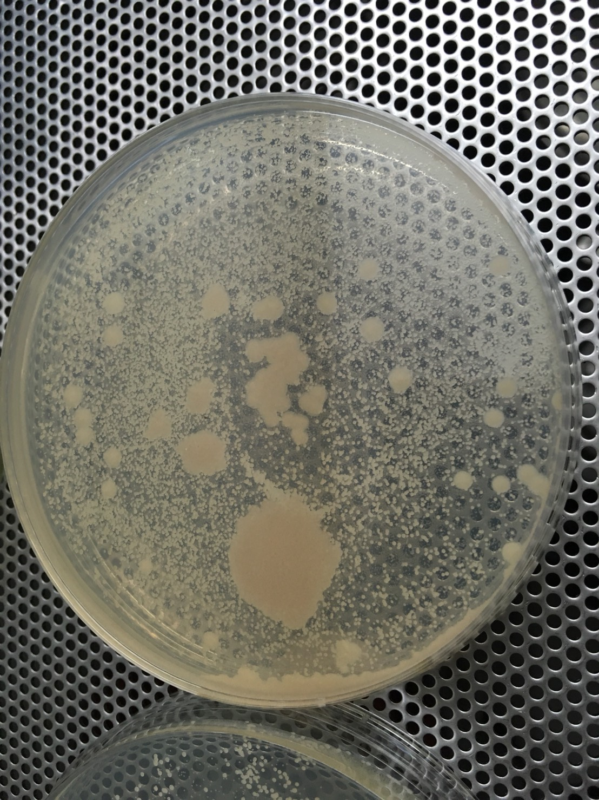
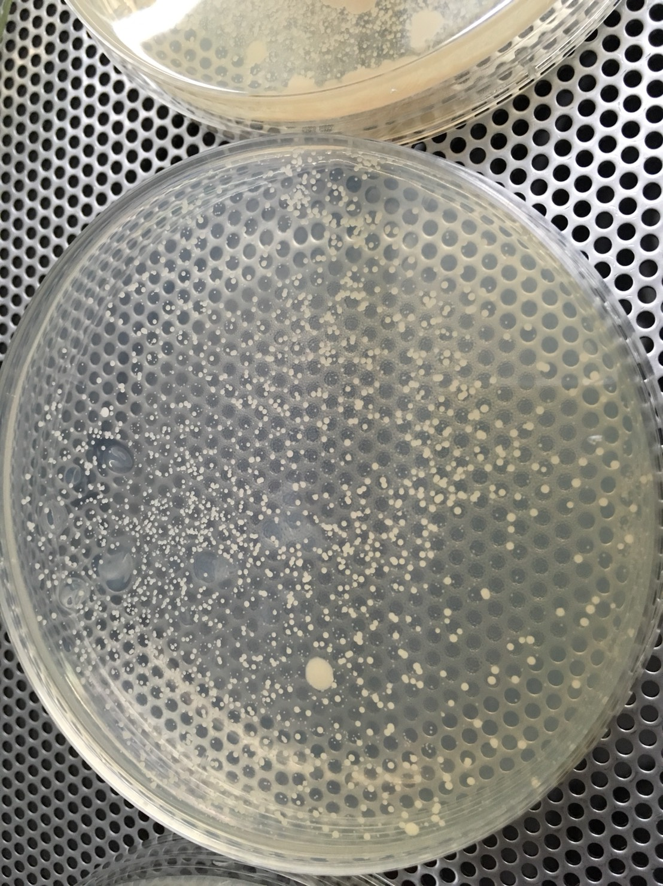
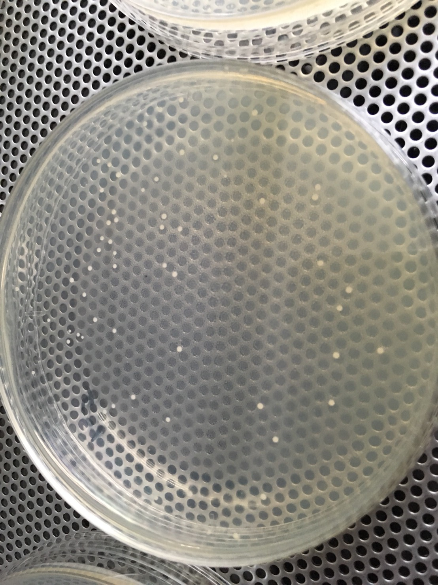
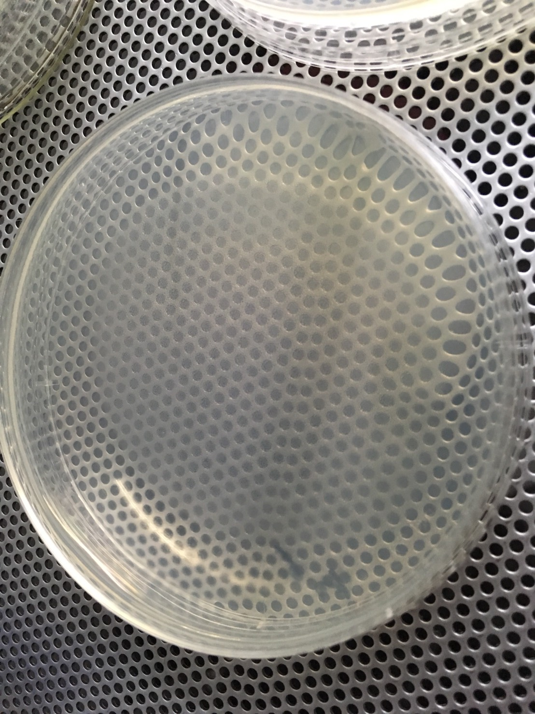
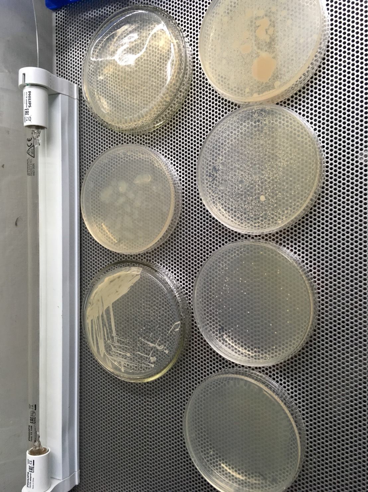
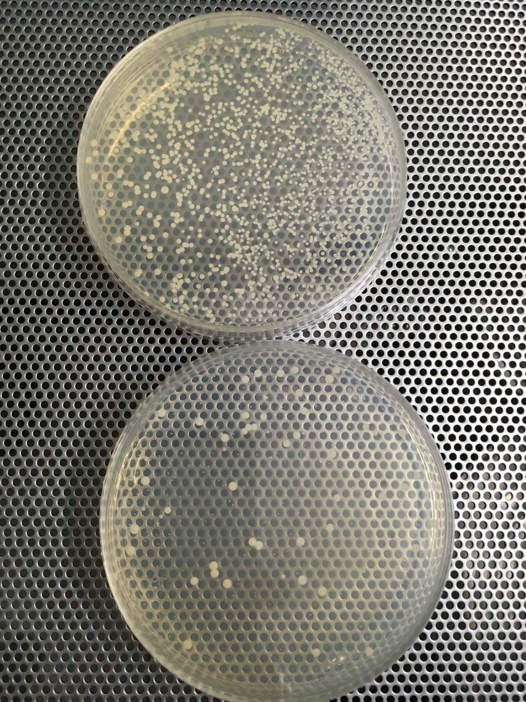

菌數計算
=====

## 平板計數法
總生菌數測定：平板計數法(plate count)
<http://www.seafood.nkmu.edu.tw/readimage.php?file=file/%E6%9E%97%E5%AE%B6%E6%B0%91%E8%80%81%E5%B8%AB_%E6%AA%94%E6%A1%88/%E5%BE%AE%E7%94%9F%E7%89%A9%E5%AD%B8%E8%88%87%E5%AF%A6%E9%A9%97/plate%20count.ppt>

[備份](opt/platecount.ppt)

### 設備準備
* 99ml水置於血清瓶中
* 4支帶蓋試管，裝9ml水
* 6片培養皿，配置Yeast Malt Agar培養基
* 刻度滴管一兩隻
* 全部滅菌

### 流程
* 撈出1ml原始菌液，加入99ml的無菌水搖勻（A）（稀釋10^2倍）
* 吸取1ml A液，加入試管中與9ml無菌水搖勻（B）（稀釋10^3倍）
* 吸取1ml B液，加入試管中與9ml無菌水搖勻（C）（稀釋10^4倍）
* 吸取1ml C液，加入試管中與9ml無菌水搖勻（D）（稀釋10^5倍）
* 吸取1ml D液，加入試管中與9ml無菌水搖勻（E）（稀釋10^6倍）
* 將ABCDE液分別取0.1ml，各自均勻塗抹培養皿，培養48~72hr (留一片對照組)
* 檢視平板上生長之菌落，大於250不採用，小於25不採用

計算：若本次選定為C平板，平板上菌落數量為112個，則代表

C管內的菌數為 112x10(塗抹0.1ml)x10ml = 1.12x10^4

由於C管是原始菌液的稀釋10^4, 所以原始菌液應該是 1.22x10^8

### 照片

A板

B板

C板

D板

合照，左上兩顆對照組（agar有點不均勻），左下原始菌泥直接抹。右邊從上到下分別是ABCD

### 友人的建議

* 用四區法 (三畫法) 純化細菌，第二畫從第一畫拉出一條之後，後面都不能再碰到第一畫(如下圖)；每一畫之間，沾菌用的loop都要燒紅放涼，再去拉下一畫。
* 一般是培養培養時間要固定，通常是overnight也就是16\~18個小時，不超過24小時，48\~72有點久，而且每次培養時間不一樣會影響判讀
* 另外一個會影響判讀的是培養基的厚度，每次要一樣多，以前規定是4 mm，以六公分的培養皿來說，是12~13cc左右，多多少少會有pipette error，這是可容許的。
* 培養基凹凸不平，有可能太早收去冰，另外就是放太久，表面開始乾燥。圖盤的時候，加下去最好馬上塗，不然等吸附一陣子再塗會塗不開。
* 連續稀釋時，每個濃度間要換tip，高的吸出來，加進下一管時要加在液面，不能整根tip戳下去
* 判讀至少要做兩重複，一方面平均，一方面看自己每次實驗的手法有沒有差很多，會比較客觀和精準

### 180624

菌數測試 乾酵母BE-134 v.s. 貝肯布液態酵母330

這次也算練手，考慮到滴定的準確度，還是不要作為評估的好

材料：

* 7x2隻試管 9cc水
* (4x2+1)x14cc agar 126cc 
* 4x2+1片平板
* 酵母：一包乾粉BE-134、一包貝肯布330

流程：

* 所有菌液加水至100cc 10^2
* 1管x10^3 
* 2管x10^4
* 3管x10^5
* 4管x10^6 取0.2ml抹平板
* 5管x10^7 取0.2ml抹平板
* 6管x10^8 取0.2ml抹平板
* 7管x10^9 取0.2ml抹平板

結果

* 上BE134 第七管：破表 
* 下1332 第七管：54 

反省

* 應該多準備一些平板與agar，總有意外不夠用
* 平板抹得沒有很均勻
* 要看清楚刻度，手上那隻一個刻度是2cc, 差點算錯
* 0.1ml就好了，0.2ml會有點流下來
* 稀釋倍數可能要弄多一點
* 乾酵母原廠標示6*10^9, 但實際數量卻爆表，相當錯愕
  * 貝肯布表示乾酵母都這樣
  * 問了原廠，他表示這個數字太誇張了，應該是做錯了（淚）
* 應該在18hr就看平板的，後面出現了很多小粒的菌叢，應該也是酵母菌，不知道是不同菌種還是怎樣，找時間擴培看看辨識一下好了
  * 貝肯布表示可能是因為菌已經冷藏保存一段時間了，有強有弱才導致此現象。只需計算最大顆的獨立無邊菌叢即可
  * 可以參照Jamil的Yeast book Part6: Your own Yeast lab made easy中的Bio test / Cell counting

