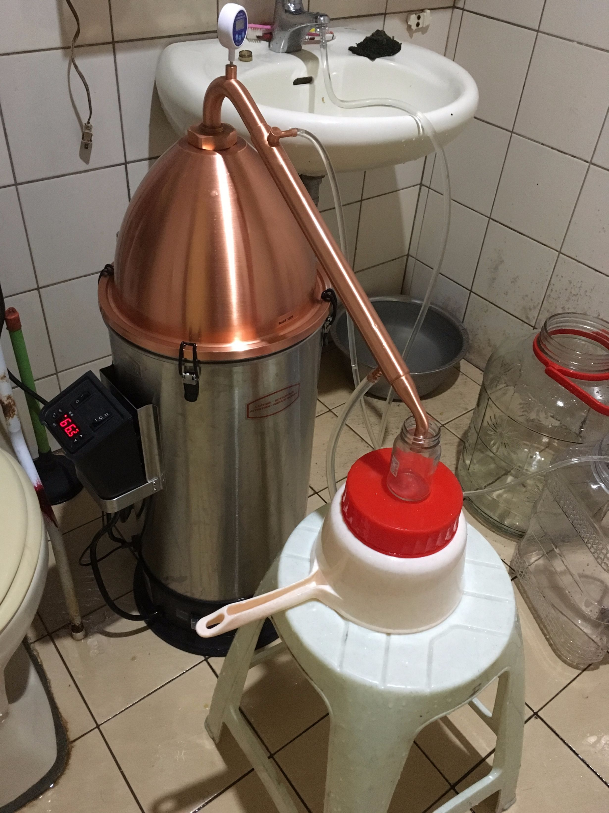
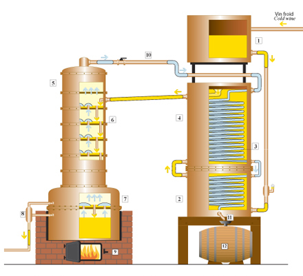
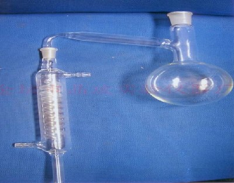

# 蒸餾

**風險**

畢竟有酒精蒸氣存在，有可能引發火焰或是爆炸的可能性，請在通風且有滅火設施的地方操作

請準備乾粉滅火器、石綿毯

電爐沒有明火可以降低一點風險，但依然要小心用電安全，確保迴路與連接足以承受這樣大電流（我就溶掉了一個三叉轉接頭...）

[http://www.pcstore.com.tw/053701111/S287594.htm](http://www.pcstore.com.tw/053701111/S287594.htm)

## 背景知識

**理由**

*   提高酒精濃度
*   ＊挽救WTF
*   清除雜質與雜菌
*   減少酒體體積（100L限制）

原酒體的特性會被帶到蒸餾後的酒中，所以如果這WTF的味道真的很崩潰，蒸出來的也會很崩潰....

是的，所以其實蒸餾並不能直接使用WTF，變成WTF的時候只能透過多次蒸餾做伏特加。

二段蒸餾之後依然會帶著些微的風味，但是大致上就是vodak了

如果要做威士忌，請準備橡木片去冷泡至少一到三年以上把風味泡出來

可以控溫熱泡，加速熟成。但我可以跟你說加速熟成的酒並不會太好喝。你可以買一罐金車威士忌熟成5年的酒和一罐熟成15年的格蘭菲迪威士忌。(金車很愛說台灣熟成一年就等於蘇格蘭熟成三年，但真喝下去你就會知道我在說什麼了。)

**酒體組成與溫度**

甲醇：沸點64.7C

*   強烈神經毒性，會導致目盲，主要來自果膠的酵素分解，其次是發酵產物。雖然自釀產生的量不至於中毒，但是風味很糟，而且會導致宿醉，所以會盡量去掉
*   一般去掉的過程稱為“去酒頭”

乙醇：沸點˙78.37C

*   主要酒精成分

高級醇：泛指更高級的醇類與各種異構物，沸點不一

*   可能是風味的來源，也可能導致異味與宿醉，怎麼拿捏是一個難處

但實務上，不會到70度甲醇就只出來甲醇，這只是一個概略比較

實際上蒸氣溫度60就會開始出液體了，然後隨著溫度提升出來的混合物也有所不同，也隨著原液中的含量決定不同溫度階段出的酒液速度

**預估**

一段蒸餾一般會蒸出30%上下的酒液，倘若原始酒液20L計算出來的酒精濃度為5%，代表你可以預期最終成品會是3.3L左右（扣掉酒頭與蒸發什麼大概剩3L吧）

**教學影片**

[https://www.youtube.com/watch?v=xIx5dX8AFGE](https://www.youtube.com/watch?v=xIx5dX8AFGE)

**發酵**

蒸餾使用的是基礎麥芽 distillery malts, peated malt。常見蒸餾麥芽酒精產率410L/噸，而啤酒麥芽MO產率350

另一方面，烈酒有專用酵母，產率較高

一般威士忌發酵時間不過三天，也沒在管感染的，糖化完不煮沸直接上，發酵槽也是木製的。這個時候的感染往往是不同酒廠間的風味特色來源

## 設備

**熱源**

瓦斯：相對便宜，但你要有夠大的爐，也有一點風險（醇類蒸氣碰到明火是會被點燃的）

電爐：電費.... 但是夏天又是水果產季 Orz

能不要用瓦斯就不要用瓦斯。

間接加熱：用蒸氣或水去加熱酒體，穩定

直接加熱：可能會產生不同的風味

蒸酒醪時很容易因為控火沒控好就臭灰搭~

**銅**

多數用銅製作，可以與硫化物結合，吃掉異味讓酒的氣味更加乾淨

也有人丟銅網下去

可丟銅網效果很好，但丟太多會讓酒出現過多的銅離子(有毒)；自己蒸餾時要小心注意一下。

**單式蒸餾器**

一個煮鍋搭配一個銅塔蓋，構造簡單，可以保留較多的香氣

附圖是GrainFather與其蒸餾套件

*使用GrainFather的話，你可能會想要幫她買一件外套，避免熱量流失節省電費

**連續蒸餾器**

適合大量生產，分成蒸餾塔與加熱塔兩部分

風味不及單式蒸餾，但可以一次就輸出90%的高酒精度，也省火

**實驗室蒸餾器**

蒸餾量太小了...不過可以很精準的控制，降溫效果很好，怕破

**其他設備**

請準備5-8個70-100ml的玻璃瓶，用來去酒頭酒尾用的

## 流程

大致上流程是這樣

**蒸餾次數**

*   一段蒸餾

酒體酒精度可能是5-12%，還有大量雜質，加熱緩慢，所以會以大火催下去，從頭到尾不停，務使在最短時間內完成，成品約20-60%，保存最多的風味，液體可能會有一點顏色

*   即便如此21L還是要蒸餾個4小時左右（GrainFather）
*   30Ｌ估計在6hr左右
*

*   二段蒸餾

進一步淨化，成品80%或更高，依然有保存一部份風味，液體透明無色

由於這階段原液的水分比例比較低，要小心空燒

*   有的vodak會蒸餾到六段去，這個時候就沒什麼風味了，就是酒精
*   5L約花2hr

**蒸餾流程**

1.  過濾原液進入煮鍋
2.  火力全開下火溫度拉升到70度（上火接近60），開始冷卻出酒
3.  前四罐用小罐收集起來
4.  如果風味ok, 開始收集本體
5.  當蒸氣溫度接近97度或是出酒量足夠，收集到小罐量測酒精度，若酒精度低於預期（對我來說10%以下）則關閉並停止收集
6.  去頭去尾，確認每一罐的風味，把合適的merge回本體，倒掉（或回收）酒頭尾，收工清理

過程中要留意不要乾燒了

## 酒頭與酒尾

酒頭：以甲醇為主，喝了傷身

酒身：以乙醇為主，也就是最好的一段

酒尾：高級醇與雜油開始變多，味道不好，氧化之後的味道很恐怖

[Zachccy Chen](https://www.facebook.com/zachccy.chen)

酒頭酒尾：中式白酒使用溫度切割，西式酒則以酒精濃度切割（也會看溫度）

西式切法90%以前是酒頭（+-5%，約10-15min）

然後辣味刺激感會慢慢掉下來，就可以看自己喜好收。

然後酒精掉到65%以下就要開始注意了。收的越低酒的味道會越重

個人喜好會在62-65%vol就停收

這是蘇格蘭威士忌的收法。干邑的話會收的較低些

儘量別去收55%以下的酒，會有太多重油脂（碳鏈長的油脂）；未來會臭

二次蒸餾的酒液盡量控制在30%以上，倘若低於30%會析出白白的油脂，氧化後的味道各種悲劇

收酒多，未來味道會越難控制，雜味也越多

## 量測方式

*   比重式
*   電子式
*   蒸氣溫度換算（液氣相平衡圖）

*   [Zachccy Chen](https://www.facebook.com/zachccy.chen)
*   小蒸餾器很難抓；所以就只能靠經驗（真的）
*   比較高等級的做法是用蒸氣溫度換算；但那個要開液氣相平衡圖，我手邊目前沒有。你可以請教秋慶慶
*   問他：60%vol的乙醇在 1bar下，液氣平衡溫度是多少？
*   乙醇氣體60%vol的液氣平衡溫度？（目前實驗大概是91.6度）

## 溫度控制

蒸餾主要看的是上面的溫度，因為如果蒸氣溫度不到，即便底下火再旺也出不去

但也要留意底下的溫度，當作二段蒸餾時可能會因為液體量少酒精度高的關係，通通轉換成蒸氣導致乾燒損毀設備甚至失火，需要有乾燒防止措施

基本上流量比較重要，流量不足代表該溫度區間的物質存量過低，該往下一個溫度區間前進，所以大致上來說就讓溫度往上走就是了

由於能量提供決定的蒸氣的轉換產出，假設下火關閉，會非常快速的導致蒸氣溫度下降，十秒內就能從90度降到60，自然也是無法出酒，所以理想的情況下是轉小火力，或是以較高的頻率切換火力來控制上火溫度才能控好純度

但畢竟這樣還是有點太複雜，也拖長蒸餾時間，往往不如直接做二段蒸餾

**關鍵溫度（實驗紀錄）**

可以確定的幾個點

* 酒頭：90%以上 +-5%, 但是如果一開始出的酒就沒那麼高，那還是要另外抓抓看
* 品質較好：85~65% 蒸氣溫度截止點92度
* 品質一般：65~55% 蒸氣溫度截止點94.8
* 酒尾：55%以下，蒸氣溫度截止點隨意，收到25%的話是98度

高酒精
<table style="font-size:13px;cell-spacing: 0px; border-collapse: collapse;"><tr><td style="border:1px solid #999; min-width: 50px;height: 22px;line-height: 16px;padding: 0 4px 0 4px;" class="added">&#37202;&#31934;&#28611;&#24230;</td>
<td style="border:1px solid #999; min-width: 50px;height: 22px;line-height: 16px;padding: 0 4px 0 4px;" class="added">&#19978;&#28779;&#28331;&#24230;</td>
<td style="border:1px solid #999; min-width: 50px;height: 22px;line-height: 16px;padding: 0 4px 0 4px;" class="added">&#19979;&#28779;&#28331;&#24230;&#65288;&#21443;&#32771;&#65289;</td>
<td style="border:1px solid #999; min-width: 50px;height: 22px;line-height: 16px;padding: 0 4px 0 4px;" class="added"></td>
</tr>
<tr><td style="border:1px solid #999; min-width: 50px;height: 22px;line-height: 16px;padding: 0 4px 0 4px;" class="added"></td>
<td style="border:1px solid #999; min-width: 50px;height: 22px;line-height: 16px;padding: 0 4px 0 4px;" class="added">42.8</td>
<td style="border:1px solid #999; min-width: 50px;height: 22px;line-height: 16px;padding: 0 4px 0 4px;" class="added">61</td>
<td style="border:1px solid #999; min-width: 50px;height: 22px;line-height: 16px;padding: 0 4px 0 4px;" class="added"></td>
</tr>
<tr><td style="border:1px solid #999; min-width: 50px;height: 22px;line-height: 16px;padding: 0 4px 0 4px;" class="added"></td>
<td style="border:1px solid #999; min-width: 50px;height: 22px;line-height: 16px;padding: 0 4px 0 4px;" class="added">44.7</td>
<td style="border:1px solid #999; min-width: 50px;height: 22px;line-height: 16px;padding: 0 4px 0 4px;" class="added">66.2</td>
<td style="border:1px solid #999; min-width: 50px;height: 22px;line-height: 16px;padding: 0 4px 0 4px;" class="added"></td>
</tr>
<tr><td style="border:1px solid #999; min-width: 50px;height: 22px;line-height: 16px;padding: 0 4px 0 4px;" class="added"></td>
<td style="border:1px solid #999; min-width: 50px;height: 22px;line-height: 16px;padding: 0 4px 0 4px;" class="added">49.8</td>
<td style="border:1px solid #999; min-width: 50px;height: 22px;line-height: 16px;padding: 0 4px 0 4px;" class="added">75.7</td>
<td style="border:1px solid #999; min-width: 50px;height: 22px;line-height: 16px;padding: 0 4px 0 4px;" class="added"></td>
</tr>
<tr><td style="border:1px solid #999; min-width: 50px;height: 22px;line-height: 16px;padding: 0 4px 0 4px;" class="added"></td>
<td style="border:1px solid #999; min-width: 50px;height: 22px;line-height: 16px;padding: 0 4px 0 4px;" class="added">63.6</td>
<td style="border:1px solid #999; min-width: 50px;height: 22px;line-height: 16px;padding: 0 4px 0 4px;" class="added">82.5</td>
<td style="border:1px solid #999; min-width: 50px;height: 22px;line-height: 16px;padding: 0 4px 0 4px;" class="added">&#23569;&#37327;&#29986;&#20986;</td>
</tr>
<tr><td style="border:1px solid #999; min-width: 50px;height: 22px;line-height: 16px;padding: 0 4px 0 4px;" class="added"></td>
<td style="border:1px solid #999; min-width: 50px;height: 22px;line-height: 16px;padding: 0 4px 0 4px;" class="added">69.2</td>
<td style="border:1px solid #999; min-width: 50px;height: 22px;line-height: 16px;padding: 0 4px 0 4px;" class="added">84.5</td>
<td style="border:1px solid #999; min-width: 50px;height: 22px;line-height: 16px;padding: 0 4px 0 4px;" class="added"></td>
</tr>
<tr><td style="border:1px solid #999; min-width: 50px;height: 22px;line-height: 16px;padding: 0 4px 0 4px;" class="added"></td>
<td style="border:1px solid #999; min-width: 50px;height: 22px;line-height: 16px;padding: 0 4px 0 4px;" class="added">77.0</td>
<td style="border:1px solid #999; min-width: 50px;height: 22px;line-height: 16px;padding: 0 4px 0 4px;" class="added">87.1</td>
<td style="border:1px solid #999; min-width: 50px;height: 22px;line-height: 16px;padding: 0 4px 0 4px;" class="added"></td>
</tr>
<tr><td style="border:1px solid #999; min-width: 50px;height: 22px;line-height: 16px;padding: 0 4px 0 4px;" class="added"></td>
<td style="border:1px solid #999; min-width: 50px;height: 22px;line-height: 16px;padding: 0 4px 0 4px;" class="added">87.6</td>
<td style="border:1px solid #999; min-width: 50px;height: 22px;line-height: 16px;padding: 0 4px 0 4px;" class="added">91.1</td>
<td style="border:1px solid #999; min-width: 50px;height: 22px;line-height: 16px;padding: 0 4px 0 4px;" class="added">&#24555;&#36895;&#20986;&#37202;</td>
</tr>
<tr><td style="border:1px solid #999; min-width: 50px;height: 22px;line-height: 16px;padding: 0 4px 0 4px;" class="added">70%</td>
<td style="border:1px solid #999; min-width: 50px;height: 22px;line-height: 16px;padding: 0 4px 0 4px;" class="added">90.4</td>
<td style="border:1px solid #999; min-width: 50px;height: 22px;line-height: 16px;padding: 0 4px 0 4px;" class="added">92.3</td>
<td style="border:1px solid #999; min-width: 50px;height: 22px;line-height: 16px;padding: 0 4px 0 4px;" class="added"></td>
</tr>
<tr><td style="border:1px solid #999; min-width: 50px;height: 22px;line-height: 16px;padding: 0 4px 0 4px;" class="added">68.5%</td>
<td style="border:1px solid #999; min-width: 50px;height: 22px;line-height: 16px;padding: 0 4px 0 4px;" class="added">91</td>
<td style="border:1px solid #999; min-width: 50px;height: 22px;line-height: 16px;padding: 0 4px 0 4px;" class="added">92.8</td>
<td style="border:1px solid #999; min-width: 50px;height: 22px;line-height: 16px;padding: 0 4px 0 4px;" class="added"></td>
</tr>
<tr><td style="border:1px solid #999; min-width: 50px;height: 22px;line-height: 16px;padding: 0 4px 0 4px;" class="added">66%</td>
<td style="border:1px solid #999; min-width: 50px;height: 22px;line-height: 16px;padding: 0 4px 0 4px;" class="added">91.6</td>
<td style="border:1px solid #999; min-width: 50px;height: 22px;line-height: 16px;padding: 0 4px 0 4px;" class="added">93.5</td>
<td style="border:1px solid #999; min-width: 50px;height: 22px;line-height: 16px;padding: 0 4px 0 4px;" class="added">&#36889;&#37002;&#35442;&#20999;</td>
</tr>
<tr><td style="border:1px solid #999; min-width: 50px;height: 22px;line-height: 16px;padding: 0 4px 0 4px;" class="added">63%</td>
<td style="border:1px solid #999; min-width: 50px;height: 22px;line-height: 16px;padding: 0 4px 0 4px;" class="added">93</td>
<td style="border:1px solid #999; min-width: 50px;height: 22px;line-height: 16px;padding: 0 4px 0 4px;" class="added">94.7</td>
<td style="border:1px solid #999; min-width: 50px;height: 22px;line-height: 16px;padding: 0 4px 0 4px;" class="added"></td>
</tr>
<tr><td style="border:1px solid #999; min-width: 50px;height: 22px;line-height: 16px;padding: 0 4px 0 4px;" class="added">57.5%</td>
<td style="border:1px solid #999; min-width: 50px;height: 22px;line-height: 16px;padding: 0 4px 0 4px;" class="added">94</td>
<td style="border:1px solid #999; min-width: 50px;height: 22px;line-height: 16px;padding: 0 4px 0 4px;" class="added">95.7</td>
<td style="border:1px solid #999; min-width: 50px;height: 22px;line-height: 16px;padding: 0 4px 0 4px;" class="added"></td>
</tr>
<tr><td style="border:1px solid #999; min-width: 50px;height: 22px;line-height: 16px;padding: 0 4px 0 4px;" class="added">53%</td>
<td style="border:1px solid #999; min-width: 50px;height: 22px;line-height: 16px;padding: 0 4px 0 4px;" class="added">94.8</td>
<td style="border:1px solid #999; min-width: 50px;height: 22px;line-height: 16px;padding: 0 4px 0 4px;" class="added">96.6</td>
<td style="border:1px solid #999; min-width: 50px;height: 22px;line-height: 16px;padding: 0 4px 0 4px;" class="added"></td>
</tr>
<tr><td style="border:1px solid #999; min-width: 50px;height: 22px;line-height: 16px;padding: 0 4px 0 4px;" class="added">44%</td>
<td style="border:1px solid #999; min-width: 50px;height: 22px;line-height: 16px;padding: 0 4px 0 4px;" class="added">95.7</td>
<td style="border:1px solid #999; min-width: 50px;height: 22px;line-height: 16px;padding: 0 4px 0 4px;" class="added">97.3</td>
<td style="border:1px solid #999; min-width: 50px;height: 22px;line-height: 16px;padding: 0 4px 0 4px;" class="added"></td>
</tr>
<tr><td style="border:1px solid #999; min-width: 50px;height: 22px;line-height: 16px;padding: 0 4px 0 4px;" class="added">40%</td>
<td style="border:1px solid #999; min-width: 50px;height: 22px;line-height: 16px;padding: 0 4px 0 4px;" class="added">96</td>
<td style="border:1px solid #999; min-width: 50px;height: 22px;line-height: 16px;padding: 0 4px 0 4px;" class="added">97.9</td>
<td style="border:1px solid #999; min-width: 50px;height: 22px;line-height: 16px;padding: 0 4px 0 4px;" class="added"></td>
</tr>
<tr><td style="border:1px solid #999; min-width: 50px;height: 22px;line-height: 16px;padding: 0 4px 0 4px;" class="added">35%</td>
<td style="border:1px solid #999; min-width: 50px;height: 22px;line-height: 16px;padding: 0 4px 0 4px;" class="added">96.8</td>
<td style="border:1px solid #999; min-width: 50px;height: 22px;line-height: 16px;padding: 0 4px 0 4px;" class="added">98.5</td>
<td style="border:1px solid #999; min-width: 50px;height: 22px;line-height: 16px;padding: 0 4px 0 4px;" class="added">&#33609;&#21619;&#38283;&#22987;</td>
</tr>
<tr><td style="border:1px solid #999; min-width: 50px;height: 22px;line-height: 16px;padding: 0 4px 0 4px;" class="added">31%</td>
<td style="border:1px solid #999; min-width: 50px;height: 22px;line-height: 16px;padding: 0 4px 0 4px;" class="added">97.3</td>
<td style="border:1px solid #999; min-width: 50px;height: 22px;line-height: 16px;padding: 0 4px 0 4px;" class="added">99</td>
<td style="border:1px solid #999; min-width: 50px;height: 22px;line-height: 16px;padding: 0 4px 0 4px;" class="added"></td>
</tr>
<tr><td style="border:1px solid #999; min-width: 50px;height: 22px;line-height: 16px;padding: 0 4px 0 4px;" class="added">26%</td>
<td style="border:1px solid #999; min-width: 50px;height: 22px;line-height: 16px;padding: 0 4px 0 4px;" class="added">97.7</td>
<td style="border:1px solid #999; min-width: 50px;height: 22px;line-height: 16px;padding: 0 4px 0 4px;" class="added">99.4</td>
<td style="border:1px solid #999; min-width: 50px;height: 22px;line-height: 16px;padding: 0 4px 0 4px;" class="added"></td>
</tr>
<tr><td style="border:1px solid #999; min-width: 50px;height: 22px;line-height: 16px;padding: 0 4px 0 4px;" class="added">20%</td>
<td style="border:1px solid #999; min-width: 50px;height: 22px;line-height: 16px;padding: 0 4px 0 4px;" class="added">98.2</td>
<td style="border:1px solid #999; min-width: 50px;height: 22px;line-height: 16px;padding: 0 4px 0 4px;" class="added">99.8</td>
<td style="border:1px solid #999; min-width: 50px;height: 22px;line-height: 16px;padding: 0 4px 0 4px;" class="added"></td>
</tr>
</table>

高殘糖
<table style="font-size:13px;cell-spacing: 0px; border-collapse: collapse;"><tr><td style="border:1px solid #999; min-width: 50px;height: 22px;line-height: 16px;padding: 0 4px 0 4px;" class="added">&#37202;&#31934;&#28611;&#24230;</td>
<td style="border:1px solid #999; min-width: 50px;height: 22px;line-height: 16px;padding: 0 4px 0 4px;" class="added">&#19978;&#28779;&#28331;&#24230;</td>
<td style="border:1px solid #999; min-width: 50px;height: 22px;line-height: 16px;padding: 0 4px 0 4px;" class="added">&#19979;&#28779;&#28331;&#24230;&#65288;&#21443;&#32771;&#65289;</td>
<td style="border:1px solid #999; min-width: 50px;height: 22px;line-height: 16px;padding: 0 4px 0 4px;" class="added"></td>
</tr>
<tr><td style="border:1px solid #999; min-width: 50px;height: 22px;line-height: 16px;padding: 0 4px 0 4px;" class="added"></td>
<td style="border:1px solid #999; min-width: 50px;height: 22px;line-height: 16px;padding: 0 4px 0 4px;" class="added">60</td>
<td style="border:1px solid #999; min-width: 50px;height: 22px;line-height: 16px;padding: 0 4px 0 4px;" class="added"></td>
<td style="border:1px solid #999; min-width: 50px;height: 22px;line-height: 16px;padding: 0 4px 0 4px;" class="added">&#38283;&#22987;&#23569;&#37327;&#29986;&#20986;</td>
</tr>
<tr><td style="border:1px solid #999; min-width: 50px;height: 22px;line-height: 16px;padding: 0 4px 0 4px;" class="added"></td>
<td style="border:1px solid #999; min-width: 50px;height: 22px;line-height: 16px;padding: 0 4px 0 4px;" class="added">65</td>
<td style="border:1px solid #999; min-width: 50px;height: 22px;line-height: 16px;padding: 0 4px 0 4px;" class="added">85.4</td>
<td style="border:1px solid #999; min-width: 50px;height: 22px;line-height: 16px;padding: 0 4px 0 4px;" class="added"></td>
</tr>
<tr><td style="border:1px solid #999; min-width: 50px;height: 22px;line-height: 16px;padding: 0 4px 0 4px;" class="added">90%</td>
<td style="border:1px solid #999; min-width: 50px;height: 22px;line-height: 16px;padding: 0 4px 0 4px;" class="added">70</td>
<td style="border:1px solid #999; min-width: 50px;height: 22px;line-height: 16px;padding: 0 4px 0 4px;" class="added"></td>
<td style="border:1px solid #999; min-width: 50px;height: 22px;line-height: 16px;padding: 0 4px 0 4px;" class="added">&#20027;&#35201;&#20986;&#30340;&#26159;&#30002;&#37255;&#65288;&#37202;&#38957;&#65289;</td>
</tr>
<tr><td style="border:1px solid #999; min-width: 50px;height: 22px;line-height: 16px;padding: 0 4px 0 4px;" class="added"></td>
<td style="border:1px solid #999; min-width: 50px;height: 22px;line-height: 16px;padding: 0 4px 0 4px;" class="added">80.8</td>
<td style="border:1px solid #999; min-width: 50px;height: 22px;line-height: 16px;padding: 0 4px 0 4px;" class="added">92.1</td>
<td style="border:1px solid #999; min-width: 50px;height: 22px;line-height: 16px;padding: 0 4px 0 4px;" class="added"></td>
</tr>
<tr><td style="border:1px solid #999; min-width: 50px;height: 22px;line-height: 16px;padding: 0 4px 0 4px;" class="added"></td>
<td style="border:1px solid #999; min-width: 50px;height: 22px;line-height: 16px;padding: 0 4px 0 4px;" class="added">92.6</td>
<td style="border:1px solid #999; min-width: 50px;height: 22px;line-height: 16px;padding: 0 4px 0 4px;" class="added">95.3</td>
<td style="border:1px solid #999; min-width: 50px;height: 22px;line-height: 16px;padding: 0 4px 0 4px;" class="added">&#24555;&#36895;&#20986;&#37202;&#20013;&#65292;&#38283;&#22987;&#35037;&#31532;&#20108;&#29942;&#37202;&#38957;</td>
</tr>
<tr><td style="border:1px solid #999; min-width: 50px;height: 22px;line-height: 16px;padding: 0 4px 0 4px;" class="added"></td>
<td style="border:1px solid #999; min-width: 50px;height: 22px;line-height: 16px;padding: 0 4px 0 4px;" class="added">94.3</td>
<td style="border:1px solid #999; min-width: 50px;height: 22px;line-height: 16px;padding: 0 4px 0 4px;" class="added">97.3</td>
<td style="border:1px solid #999; min-width: 50px;height: 22px;line-height: 16px;padding: 0 4px 0 4px;" class="added"></td>
</tr>
<tr><td style="border:1px solid #999; min-width: 50px;height: 22px;line-height: 16px;padding: 0 4px 0 4px;" class="added">40%</td>
<td style="border:1px solid #999; min-width: 50px;height: 22px;line-height: 16px;padding: 0 4px 0 4px;" class="added">96</td>
<td style="border:1px solid #999; min-width: 50px;height: 22px;line-height: 16px;padding: 0 4px 0 4px;" class="added">99</td>
<td style="border:1px solid #999; min-width: 50px;height: 22px;line-height: 16px;padding: 0 4px 0 4px;" class="added"></td>
</tr>
<tr><td style="border:1px solid #999; min-width: 50px;height: 22px;line-height: 16px;padding: 0 4px 0 4px;" class="added">34%</td>
<td style="border:1px solid #999; min-width: 50px;height: 22px;line-height: 16px;padding: 0 4px 0 4px;" class="added">96.8</td>
<td style="border:1px solid #999; min-width: 50px;height: 22px;line-height: 16px;padding: 0 4px 0 4px;" class="added">99.8</td>
<td style="border:1px solid #999; min-width: 50px;height: 22px;line-height: 16px;padding: 0 4px 0 4px;" class="added"></td>
</tr>
<tr><td style="border:1px solid #999; min-width: 50px;height: 22px;line-height: 16px;padding: 0 4px 0 4px;" class="added">30%</td>
<td style="border:1px solid #999; min-width: 50px;height: 22px;line-height: 16px;padding: 0 4px 0 4px;" class="added">97.2</td>
<td style="border:1px solid #999; min-width: 50px;height: 22px;line-height: 16px;padding: 0 4px 0 4px;" class="added">100</td>
<td style="border:1px solid #999; min-width: 50px;height: 22px;line-height: 16px;padding: 0 4px 0 4px;" class="added"></td>
</tr>
<tr><td style="border:1px solid #999; min-width: 50px;height: 22px;line-height: 16px;padding: 0 4px 0 4px;" class="added">25%</td>
<td style="border:1px solid #999; min-width: 50px;height: 22px;line-height: 16px;padding: 0 4px 0 4px;" class="added">97.7</td>
<td style="border:1px solid #999; min-width: 50px;height: 22px;line-height: 16px;padding: 0 4px 0 4px;" class="added">100</td>
<td style="border:1px solid #999; min-width: 50px;height: 22px;line-height: 16px;padding: 0 4px 0 4px;" class="added"></td>
</tr>
<tr><td style="border:1px solid #999; min-width: 50px;height: 22px;line-height: 16px;padding: 0 4px 0 4px;" class="added">22.5%</td>
<td style="border:1px solid #999; min-width: 50px;height: 22px;line-height: 16px;padding: 0 4px 0 4px;" class="added">98</td>
<td style="border:1px solid #999; min-width: 50px;height: 22px;line-height: 16px;padding: 0 4px 0 4px;" class="added">100</td>
<td style="border:1px solid #999; min-width: 50px;height: 22px;line-height: 16px;padding: 0 4px 0 4px;" class="added"></td>
</tr>
<tr><td style="border:1px solid #999; min-width: 50px;height: 22px;line-height: 16px;padding: 0 4px 0 4px;" class="added">19%</td>
<td style="border:1px solid #999; min-width: 50px;height: 22px;line-height: 16px;padding: 0 4px 0 4px;" class="added">98.3</td>
<td style="border:1px solid #999; min-width: 50px;height: 22px;line-height: 16px;padding: 0 4px 0 4px;" class="added">100</td>
<td style="border:1px solid #999; min-width: 50px;height: 22px;line-height: 16px;padding: 0 4px 0 4px;" class="added"></td>
</tr>
<tr><td style="border:1px solid #999; min-width: 50px;height: 22px;line-height: 16px;padding: 0 4px 0 4px;" class="added">13%</td>
<td style="border:1px solid #999; min-width: 50px;height: 22px;line-height: 16px;padding: 0 4px 0 4px;" class="added">98.8</td>
<td style="border:1px solid #999; min-width: 50px;height: 22px;line-height: 16px;padding: 0 4px 0 4px;" class="added">100</td>
<td style="border:1px solid #999; min-width: 50px;height: 22px;line-height: 16px;padding: 0 4px 0 4px;" class="added">&#24046;&#19981;&#22810;&#38283;&#22987;&#26377;&#38738;&#33609;&#21619;&#20102;</td>
</tr>
<tr><td style="border:1px solid #999; min-width: 50px;height: 22px;line-height: 16px;padding: 0 4px 0 4px;" class="added">10%</td>
<td style="border:1px solid #999; min-width: 50px;height: 22px;line-height: 16px;padding: 0 4px 0 4px;" class="added">99</td>
<td style="border:1px solid #999; min-width: 50px;height: 22px;line-height: 16px;padding: 0 4px 0 4px;" class="added">100</td>
<td style="border:1px solid #999; min-width: 50px;height: 22px;line-height: 16px;padding: 0 4px 0 4px;" class="added"></td>
</tr>
</table>

二段蒸餾（超高酒精50-80%）
<table style="font-size:13px;cell-spacing: 0px; border-collapse: collapse;"><tr><td style="border:1px solid #999; min-width: 50px;height: 22px;line-height: 16px;padding: 0 4px 0 4px;" class="added">&#37202;&#31934;&#28611;&#24230;</td>
<td style="border:1px solid #999; min-width: 50px;height: 22px;line-height: 16px;padding: 0 4px 0 4px;" class="added">&#19978;&#28779;&#28331;&#24230;</td>
<td style="border:1px solid #999; min-width: 50px;height: 22px;line-height: 16px;padding: 0 4px 0 4px;" class="added">&#19979;&#28779;&#28331;&#24230;&#65288;&#21443;&#32771;&#65289;</td>
</tr>
<tr><td style="border:1px solid #999; min-width: 50px;height: 22px;line-height: 16px;padding: 0 4px 0 4px;" class="added">79%</td>
<td style="border:1px solid #999; min-width: 50px;height: 22px;line-height: 16px;padding: 0 4px 0 4px;" class="added">85.5</td>
<td style="border:1px solid #999; min-width: 50px;height: 22px;line-height: 16px;padding: 0 4px 0 4px;" class="added">87.6</td>
</tr>
<tr><td style="border:1px solid #999; min-width: 50px;height: 22px;line-height: 16px;padding: 0 4px 0 4px;" class="added">70%</td>
<td style="border:1px solid #999; min-width: 50px;height: 22px;line-height: 16px;padding: 0 4px 0 4px;" class="added">90</td>
<td style="border:1px solid #999; min-width: 50px;height: 22px;line-height: 16px;padding: 0 4px 0 4px;" class="added">92.1</td>
</tr>
<tr><td style="border:1px solid #999; min-width: 50px;height: 22px;line-height: 16px;padding: 0 4px 0 4px;" class="added">65%</td>
<td style="border:1px solid #999; min-width: 50px;height: 22px;line-height: 16px;padding: 0 4px 0 4px;" class="added">91.6</td>
<td style="border:1px solid #999; min-width: 50px;height: 22px;line-height: 16px;padding: 0 4px 0 4px;" class="added">93.5</td>
</tr>
</table>

酒尾蒸餾
<table style="font-size:13px;cell-spacing: 0px; border-collapse: collapse;"><tr><td style="border:1px solid #999; min-width: 50px;height: 22px;line-height: 16px;padding: 0 4px 0 4px;" class="added">&#37202;&#31934;&#28611;&#24230;</td>
<td style="border:1px solid #999; min-width: 50px;height: 22px;line-height: 16px;padding: 0 4px 0 4px;" class="added">&#19978;&#28779;&#28331;&#24230;</td>
<td style="border:1px solid #999; min-width: 50px;height: 22px;line-height: 16px;padding: 0 4px 0 4px;" class="added">&#19979;&#28779;&#28331;&#24230;&#65288;&#21443;&#32771;&#65289;</td>
<td style="border:1px solid #999; min-width: 50px;height: 22px;line-height: 16px;padding: 0 4px 0 4px;" class="added"></td>
</tr>
<tr><td style="border:1px solid #999; min-width: 50px;height: 22px;line-height: 16px;padding: 0 4px 0 4px;" class="added"></td>
<td style="border:1px solid #999; min-width: 50px;height: 22px;line-height: 16px;padding: 0 4px 0 4px;" class="added">70</td>
<td style="border:1px solid #999; min-width: 50px;height: 22px;line-height: 16px;padding: 0 4px 0 4px;" class="added">85</td>
<td style="border:1px solid #999; min-width: 50px;height: 22px;line-height: 16px;padding: 0 4px 0 4px;" class="added">&#20986;&#37202;&#38283;&#22987;&#21152;&#36895;</td>
</tr>
<tr><td style="border:1px solid #999; min-width: 50px;height: 22px;line-height: 16px;padding: 0 4px 0 4px;" class="added"></td>
<td style="border:1px solid #999; min-width: 50px;height: 22px;line-height: 16px;padding: 0 4px 0 4px;" class="added">80</td>
<td style="border:1px solid #999; min-width: 50px;height: 22px;line-height: 16px;padding: 0 4px 0 4px;" class="added">88.5</td>
<td style="border:1px solid #999; min-width: 50px;height: 22px;line-height: 16px;padding: 0 4px 0 4px;" class="added"></td>
</tr>
<tr><td style="border:1px solid #999; min-width: 50px;height: 22px;line-height: 16px;padding: 0 4px 0 4px;" class="added">81%</td>
<td style="border:1px solid #999; min-width: 50px;height: 22px;line-height: 16px;padding: 0 4px 0 4px;" class="added">87.0</td>
<td style="border:1px solid #999; min-width: 50px;height: 22px;line-height: 16px;padding: 0 4px 0 4px;" class="added">89.1</td>
<td style="border:1px solid #999; min-width: 50px;height: 22px;line-height: 16px;padding: 0 4px 0 4px;" class="added">&#33609;&#21619;= =</td>
</tr>
<tr><td style="border:1px solid #999; min-width: 50px;height: 22px;line-height: 16px;padding: 0 4px 0 4px;" class="added">73.5%</td>
<td style="border:1px solid #999; min-width: 50px;height: 22px;line-height: 16px;padding: 0 4px 0 4px;" class="added">88.4</td>
<td style="border:1px solid #999; min-width: 50px;height: 22px;line-height: 16px;padding: 0 4px 0 4px;" class="added">90.3</td>
<td style="border:1px solid #999; min-width: 50px;height: 22px;line-height: 16px;padding: 0 4px 0 4px;" class="added"></td>
</tr>
<tr><td style="border:1px solid #999; min-width: 50px;height: 22px;line-height: 16px;padding: 0 4px 0 4px;" class="added">69%</td>
<td style="border:1px solid #999; min-width: 50px;height: 22px;line-height: 16px;padding: 0 4px 0 4px;" class="added">90</td>
<td style="border:1px solid #999; min-width: 50px;height: 22px;line-height: 16px;padding: 0 4px 0 4px;" class="added">91.9</td>
<td style="border:1px solid #999; min-width: 50px;height: 22px;line-height: 16px;padding: 0 4px 0 4px;" class="added"></td>
</tr>
<tr><td style="border:1px solid #999; min-width: 50px;height: 22px;line-height: 16px;padding: 0 4px 0 4px;" class="added">67.5%</td>
<td style="border:1px solid #999; min-width: 50px;height: 22px;line-height: 16px;padding: 0 4px 0 4px;" class="added">91</td>
<td style="border:1px solid #999; min-width: 50px;height: 22px;line-height: 16px;padding: 0 4px 0 4px;" class="added">92.8</td>
<td style="border:1px solid #999; min-width: 50px;height: 22px;line-height: 16px;padding: 0 4px 0 4px;" class="added"></td>
</tr>
<tr><td style="border:1px solid #999; min-width: 50px;height: 22px;line-height: 16px;padding: 0 4px 0 4px;" class="added">66%</td>
<td style="border:1px solid #999; min-width: 50px;height: 22px;line-height: 16px;padding: 0 4px 0 4px;" class="added">91.4</td>
<td style="border:1px solid #999; min-width: 50px;height: 22px;line-height: 16px;padding: 0 4px 0 4px;" class="added">93.3</td>
<td style="border:1px solid #999; min-width: 50px;height: 22px;line-height: 16px;padding: 0 4px 0 4px;" class="added"></td>
</tr>
<tr><td style="border:1px solid #999; min-width: 50px;height: 22px;line-height: 16px;padding: 0 4px 0 4px;" class="added">64.5%</td>
<td style="border:1px solid #999; min-width: 50px;height: 22px;line-height: 16px;padding: 0 4px 0 4px;" class="added">91.7</td>
<td style="border:1px solid #999; min-width: 50px;height: 22px;line-height: 16px;padding: 0 4px 0 4px;" class="added">93.5</td>
<td style="border:1px solid #999; min-width: 50px;height: 22px;line-height: 16px;padding: 0 4px 0 4px;" class="added"></td>
</tr>
</table>

## 技巧參考

https://read01.com/k02dN2.html

第一階段（開始階段）：蒸餾溫度在78.3攝氏度以下，所接的酒稱為酒頭。每投糧100公斤掐酒頭1斤。酒頭內的低分子雜醇油、低級脂肪酸酯、醛等含量較多，有一定香氣，但雜味重、暴燥味大，對人視覺有傷害，一般單獨接出來存放。

第二階段（中間階段）：蒸溜溫度在78.3～95攝氏度之間，所接的酒屬正流酒，也是理想的商品酒。其主要成分是酒精，酒的度數在50度左右。

第三階段（後期階段）：蒸餾溫度在100攝氏度左右，所接的酒稱為酒尾，酒尾中乳酸及其酯類比酒頭和正流酒含量高几倍，還含有亞油酸乙酯、油酸乙酯、棕櫚酸乙酯等高級脂肪酸酯和較多的雜醇油，酒味雜且苦澀，酒質渾濁，應單獨接出與酒頭一起存放。

在蒸餾過程中第一階段應採用大火，把酒頭蒸出來；第二階段火力要平、穩，關閉鼓風機，緩汽蒸餾，此階段勿要火急。

通過實踐證實，慢火蒸餾酒中酯含量高於快火2%，而且蒸餾效率也高於快火10%左右，因慢火蒸餾，蒸汽壓力低，上汽均勻，從而使酒內香味成分被水蒸汽拖帶於酒中，使酒的香味成分含量高，酒的質量也較優。第三階段火要大、猛、急，因酒尾含有高沸點物質只有大汽追尾才能蒸出來。

*   能否提供2%和10%的文獻來源？
*   姆，我也只是擷取上面的文章，來源不可考

通常酒尾出來太多很容易造成酒心的酒味道濃厚，氧化後會很噁心，切記不要貪多就收多了，要適時地放手進入酒尾重蒸。

[http://www.mdais.gov.tw/ws.php?id=1546](http://www.mdais.gov.tw/ws.php?id=1546)

酒尾可另外收集起來混入下一批的酒醪一起蒸餾。

有些人認為發酵失敗後可利用蒸餾技術做出好的 蒸餾酒，但沒有好的酒醪是不可能有好的蒸餾酒的，即所謂「造香在發酵，提香在蒸餾」，對蒸餾酒而言，發酵與蒸餾同等重要。

發酵失敗的酒不會有好的蒸餾酒，白酒就是很好的一例，很多白酒其實味道非常噁心，因為就是雜菌感染太嚴重所造成的味道。

## 自動化

目前GrainFather的溫度控制還是以下火溫度為主，上火靠人眼去判斷操作。

由於流量考量，由人為判斷確實是比較好的做法

如果要自動化，可能要做幾項

*   下火乾燒防護機制，溫度超過102度切掉整個系統（溫度要抓，如果是高濃度的酒體確實有可能超過）
*   上火PID控制，精確控制
*   出酒比重量測，低於一定值切掉整個系統，蒸餾完成
*   出酒流量量測，低於一定值將溫度向上一個區間

這好像有點複雜（汗

[http://goods.ruten.com.tw/item/show?21304240640736](http://goods.ruten.com.tw/item/show?21304240640736)

流量感測器

另一種作法是管他3721火力連續輸出，上火溫度到99時切掉