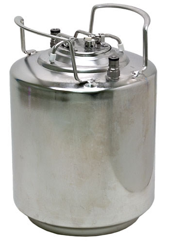
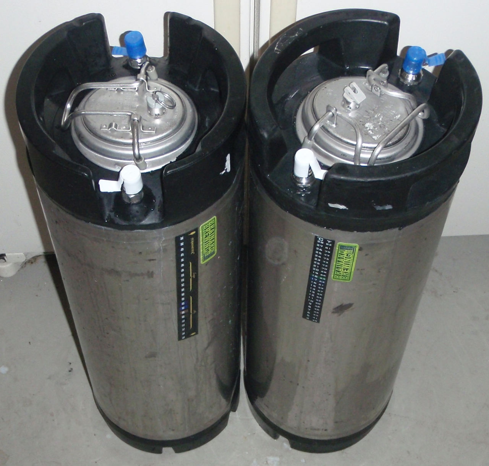
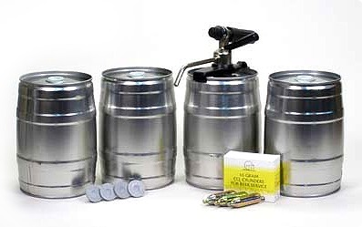
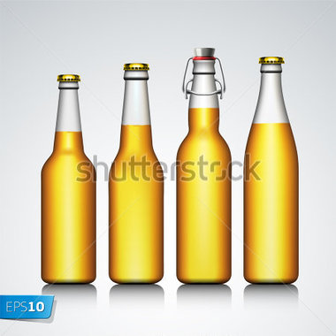

# 裝瓶容器比較

## Keg

**優點**

*   不鏽鋼材質，不易生鏽
*   一般會有緊急洩壓閥，較為安全
*   可以做強制充氣

**缺點**

*   加工可能會殘留黑油，不好清理
*   價格最貴
*   酒的味道不知道為什麼會有變淡的感覺
*   操作複雜

## 可樂桶

**優點**

*   不鏽鋼材質，不易生鏽
*   一般會有緊急洩壓閥，較為安全
*   二手價格划算
*   可以做強制充氣

**缺點**

*   操作複雜

## mini keg

**優點**

*   5L小巧，可收入冰箱
*   價格不貴
*   操作簡單
*   由於市面上有些5L商業啤酒也用mini keg, 有時是可以[再生使用的](https://www.facebook.com/groups/homebrew.tw/permalink/1347039358646702/)

*

https://[www.youtube.com/watch?v=8ZGKhHe_L5Q](https://l.facebook.com/l.php?u=https%3A%2F%2Fwww.youtube.com%2Fwatch%3Fv%3D8ZGKhHe_L5Q&h=MAQHE-ZeJ)

**缺點**

*   馬口鐵材質，**可能生鏽**
*   加工可能會殘留黑油，不好清理
*   大致上來說不建議重複使用
*   過載洩壓裝置需要另購
*   酒的味道不知道為什麼會有變淡的感覺
*   清洗很難瀝乾
*   如果沒洩壓閥，爆了應該很危險

## 玻璃瓶

**優點**

*   玻璃材質，對酒體保存最好
*   可重複使用，但一樣有使用壽命限制
*   容易取得
*   價格便宜
*   操作簡便

**缺點**

*   承受壓力較低，爆裂可能有碎片
*   清洗有點煩人
*   皇冠蓋需要壓瓶器與瓶蓋才能封口
*   搖擺頭有漏氣跟金屬疲勞風險
*   皇冠蓋材質為PET, 不可高溫消毒

**注意**

* 避開太薄的瓶子，可能會炸
* 避開顏色不夠深、綠色的瓶子（光照臭）

**收集點**

* 進口酒基本上沒有退瓶，所以大多願意免費提供
* ashi黑色瓶子厚度又夠
* 熱炒店
* 精釀啤酒店
* 雜貨店、薑母鴨米酒瓶，一支兩元

## 塑膠瓶

可樂瓶，或是其他可耐壓塑膠瓶

<https://www.facebook.com/groups/homebrew.tw/permalink/1603884242962211/>

[陳明志](https://www.facebook.com/profile.php?id=100000268336591&fref=ufi) 那個...如果真的收不到玻璃瓶，這個可以試試，我現在都改用這個裝，CN0500-006那個，蓋子記得要買膠片蓋的喔！

<http://changyo-pet.blogspot.tw/p/blog-page_28.html?m=0>

一箱，220個，算起來約5塊錢一個，詳細請您跟廠家詢問，只是要跟他們確認改膠片蓋(汽水瓶用那種)。

可以搭配龍頭出酒

<https://www.taobao.com/product/%E6%B1%BD%E6%B0%B4%E9%BE%8D%E9%A0%AD.htm>

**優點**

* 便宜
* 不會破
* 輕便

**缺點**

* 抗紫外線能力不佳
* 可能比較容易漏氣
* 畢竟是塑膠製品...
