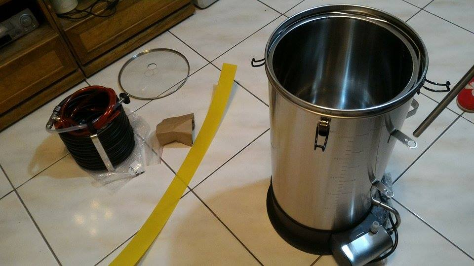
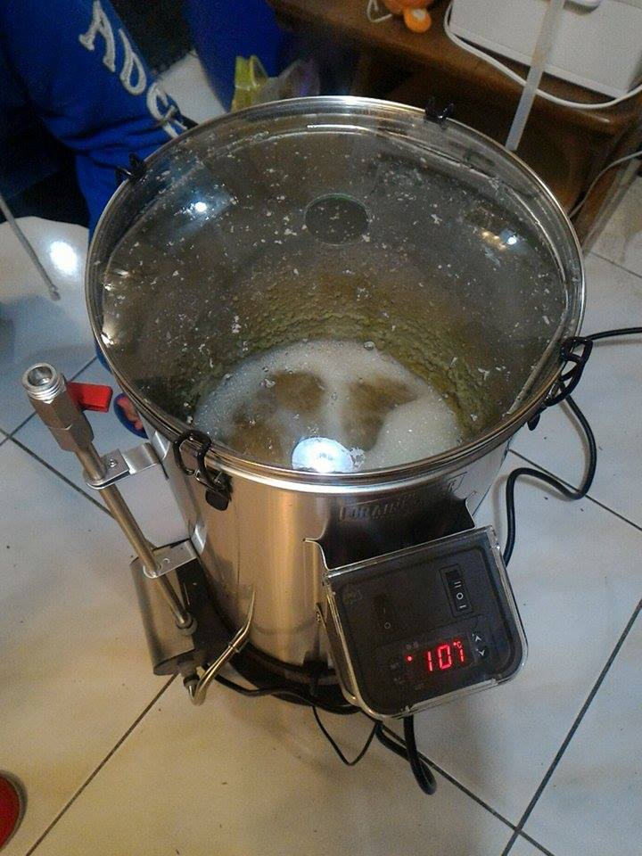

# 試用GrainFather半自動糖化

## 簡介

半自動釀酒設備，容量30L，負責多階段糖化、煮花、冷卻三階段

另有蒸餾模組可加購

[http://www.grainfather.com/#!home/mainPage](http://www.grainfather.com/#)

**官方影片**

[https://youtu.be/rUONP5YNq0s](https://youtu.be/rUONP5YNq0s)

[http://youtu.be/2L10S5Fx0xY](http://youtu.be/2L10S5Fx0xY)

**使用手冊**

待補

## 釀造紀錄

[160211試用、釀造紀錄](/Brewing-History-Aibs59hsIWB#:h=160211-Nelson-GrainFather測試) //FIXME

## 心得

設備有點大台，可以容納30L這點很棒

畢竟是吃電煮沸，所以升溫時間有點長，這可以理解。

中間有個提把可以把整個內鍋抽出來，可以架在桶上做洗槽，同時又能把底部翻過去快速清除麥渣，優秀的設計

隨附的冷卻管很棒，換熱效率極高，出麥汁的同時就可以直接進發酵桶了，基本上光這個元件就[不少錢](熱麥汁冷卻機制.md)

整機零件有點多，不過組裝上並不困難，三個臭皮匠花點功夫還是搞定了ＸＤ

反倒是控制器沒有文件教學，使用起來滿傷腦筋的

煮花階段，前面火有點太大把酒花都噴上去了，不知道會不會影響

最後用完要記得刷一下鍋底，那邊會有一些蛋白熱渣黏著

整體來說是很划算的價格，自己搞的話光是那些客製化的硬體就快兩萬了，值得購買。