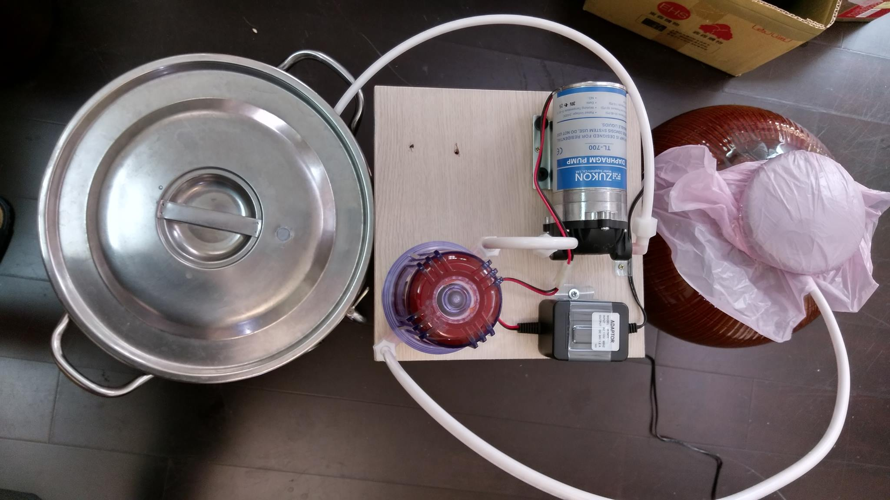

# 過濾

[https://www.facebook.com/groups/homebrew.tw/permalink/1391166080900696/](https://www.facebook.com/groups/homebrew.tw/permalink/1391166080900696/)

[https://www.facebook.com/groups/homebrew.tw/permalink/1396210513729586/](https://www.facebook.com/groups/homebrew.tw/permalink/1396210513729586/)

[https://www.facebook.com/groups/homebrew.tw/permalink/1396212840396020/](https://www.facebook.com/groups/homebrew.tw/permalink/1396212840396020/)

[by TW Chu ](https://www.facebook.com/tw.chu.1?fref=ufi) 

*

https://www.youtube.com/watch?v=YOclJsjZnyY&feature=youtu.be

**目標**

減少混濁

用在已發酵過濾（未發酵也行）

**缺點**

增加曝氧機率

**構造**

材質(同飲水過濾器):濾殼 PET 管材 PE (基本上酒精可用)

馬達：台灣淯成TL-700大流量家用型RO逆滲透馬達適用50G~75G 有自吸，但流量不大， 約470$

**過濾材**

重點在濾心..想濾什麼用什麼濾心吧..

酵母細胞大小約為 2～5 × 5～30μm（短軸×長軸）

50 μm 目的是要保留酵母細胞 ? (酵母菌可通過)

一般 PP 濾芯多為 5μm , 1 μm 約NTD 15~25 元

0.2μm量濾膜 (Taobao 有 ) 約25~45RMB

PP棉芯 50 μm Taobao 有賣

10寸平壓繞線濾芯 線繞濾芯1微米5微米50um可選 PP棉芯繞線

https://world.taobao.com/item/15895503835.htm?spm=a312a.7700714.0.0.3k4xhl#detail

量濾膜：清洗可重複使用

一次性濾芯：

PP濾心 <--5um 1um NTD15~25

CTO活性碳濾芯

UDF活性碳濾芯

**消毒**

非正解:

釀造酒:

清洗消毒管線濾殼

一次性濾芯 (符合NSF規範)保護膜拆開直接使用.

重複使用的濾膜 要清洗消毒

蒸餾酒:(高酒精度)

高酒精度 (偷懶不在意味道) 直接用

PP濾心新品有保護膜 懶的再消毒

清洗濾殼管線, 無濾心組裝後 抽送 75~70%酒精

(或其他可消毒的食品級消毒劑)消毒濾殼,PUMP,管線

拆開濾心保護膜 裝上濾心後 抽酒 過濾