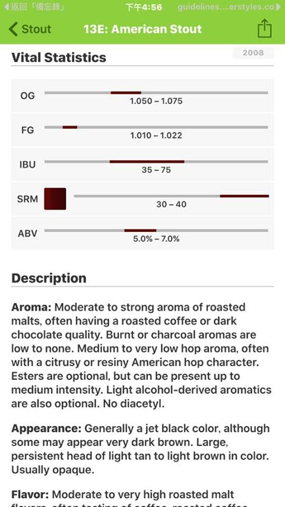
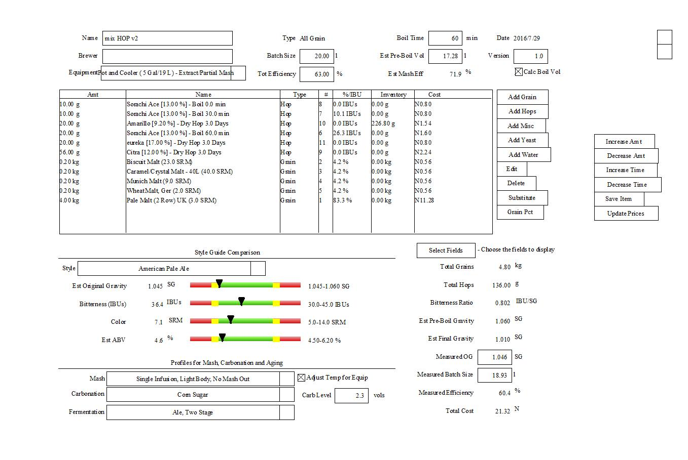
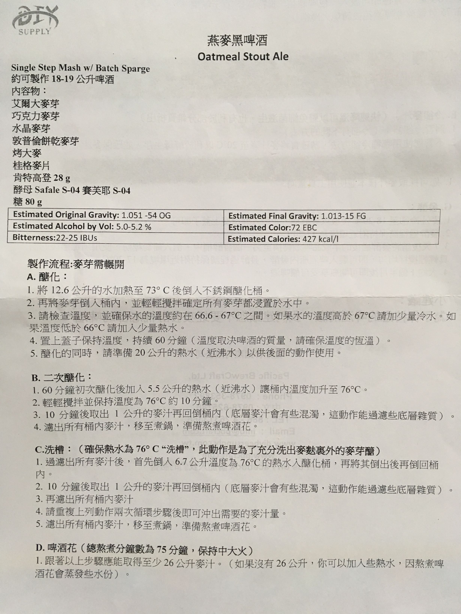
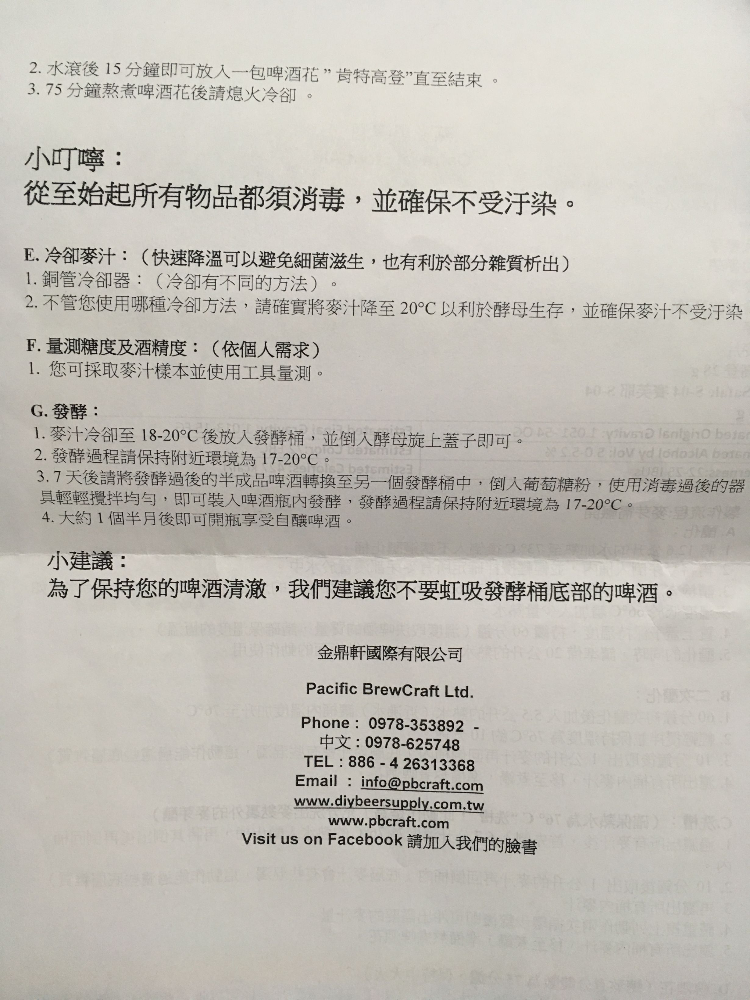
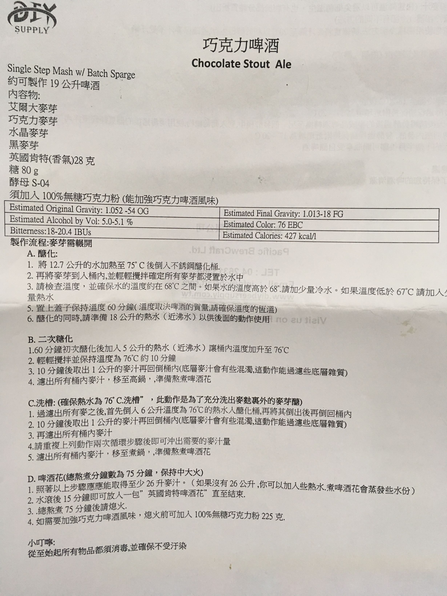
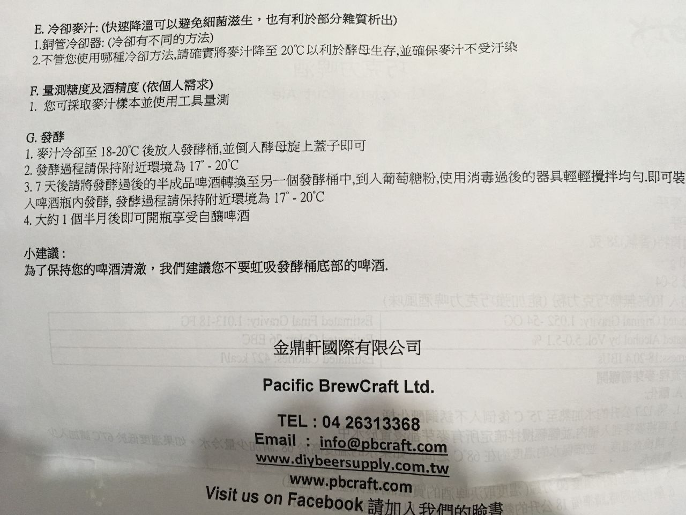
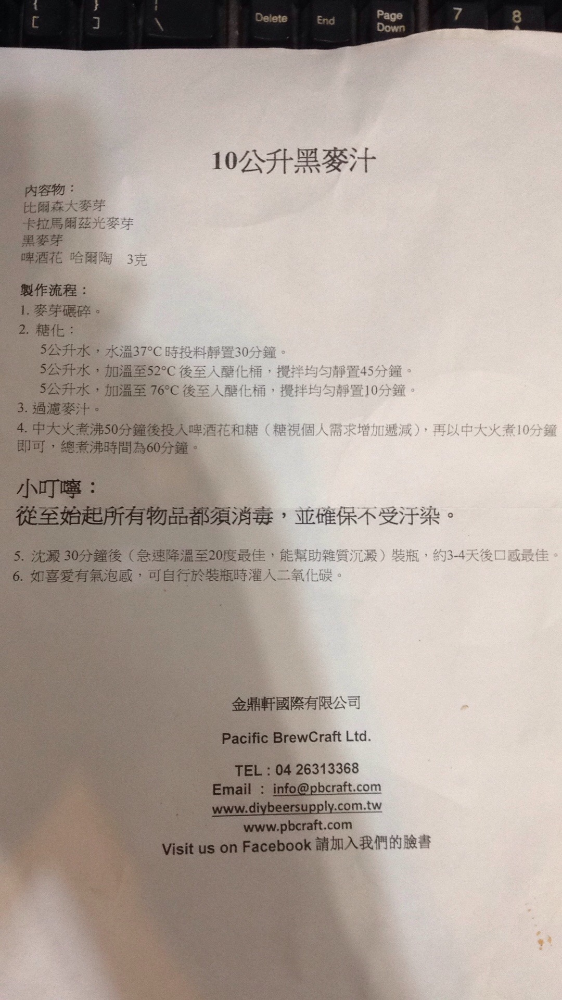
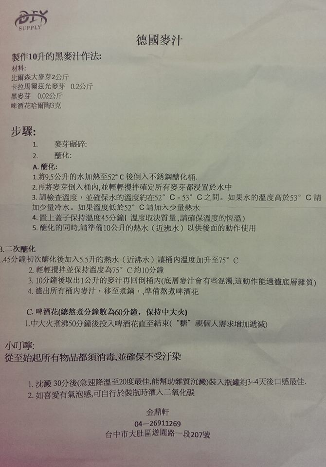
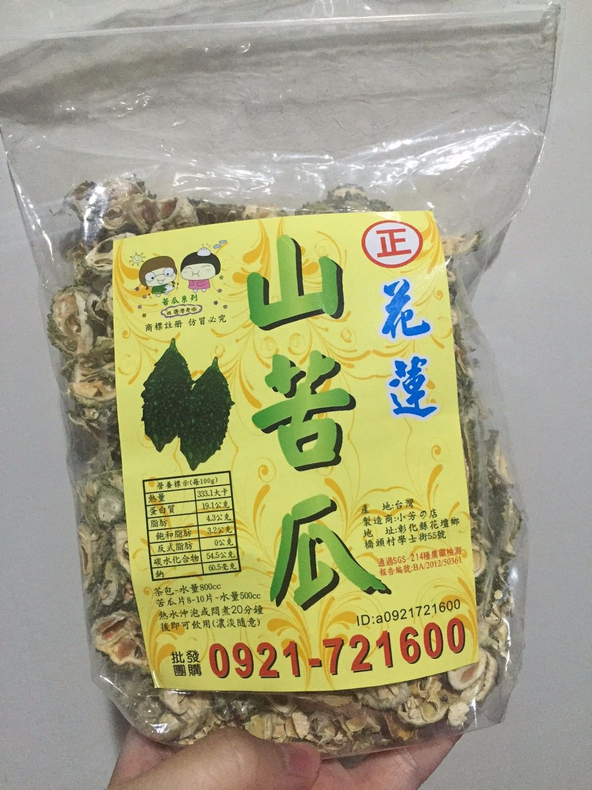

# 酒譜

## 國外酒譜集結區

[http://www.brewersfriend.com/](http://www.brewersfriend.com/)

[https://www.brewtoad.com/](https://www.brewtoad.com/)

[50種Clone beer](https://www.homebrewersassociation.org/top-50-commercial-clone-beer-recipes/?utm_source=informz&utm_medium=email&utm_campaign=default&_zs=pAU2G1&_zl=RC5u3)

[80種經典酒譜](https://www.bookdepository.com/Brewing-Classic-Styles-Jamil-Zainasheff-John-J-Palmer/9780937381922?ref=grid-view&qid=1500963529592&sr=1-1)

<https://www.vlb-berlin.org/en/technology-brewing-and-malting>

## 得獎酒譜

### 2012台灣自釀大賽
[2012 第一屆台灣自釀啤酒大賽得獎作品配方](https://sites.google.com/site/homebrewtw/recipe/2012-homebrew-competition-recipe)

### 釀酒人樂園第二屆
**Stout組第一名 America Stout**

by ‎[Kenji Kuo](https://www.facebook.com/kenji.kuo01?fref=nf)‎ 

America Stout(20L)

* 4350g Kloster Munich
* 350g Kloster T3(咖啡大麥芽)
* 150g Oatmeal(燕麥片)
* 150g Carafa (深卡拉)

* Centennial 啤酒花20g
* Amarillo 啤酒花20g

* US-05酵母一包

Og 1.058 Fg 1.018

### 2016第五屆台灣自釀啤酒大賽

1、拉格組：

* 冠軍：林科佑，9C. Baltic Porter。
* 亞軍：許根源，1A. American Light Lager。
* 季軍：牟善群，1C. CREAM ALE。

2、美式組：

* 冠軍：鄭鴻暉，20A. American Porter。
* 亞軍：呂重諺，18B. American Pale Ale。
* 季軍：邱宏華，18B. American Pale Ale。

3、比利時及德式組：

* 冠軍：陳楷明，26D Belgian Dark Strong Ale。
* 亞軍：呂重諺，10A. Weissbier。
* 季軍：蕭玉萍，24A. Witbier。

4、英式組：

* 冠軍：匡璿，15C. Irish Extra Stout。
* 亞軍：呂俊緯，13C. English Porter。
* 季軍：李官達，11C. Strong Bitter。

5、實驗組：

* 冠軍：郭叡，30A.Spiced Beer / 丁香枝 草荳蔻 桂皮。
* 亞軍：邱奕慶，29A. Fruit Beer / 屏東檸檬。
* 季軍：黃俊能，34C.Experimental Beer /肯亞咖啡豆。

總冠軍：

* 匡璿，15C. Irish Extra Stout。

總亞軍：

* 陳楷明，26D Belgian Dark Strong Ale。

#### 15C. Irish Extra Stout。
英式組暨總冠軍：[匡璿](https://www.facebook.com/profile.php?id=100002126707039&fref=nf) 

批次:9.5L

麥芽:

* Pale Ale Malt 2kg(80%
* Roasted Barley 0.25kg(10%)
* Special B 0.15kg(6%)
* Rye Malt 0.1kg(4%)

Hops:

* Cascade 10g/60min
* Cascade 15g/5min
* EKG 50g/5min

* Yeast: Yes Yeast EA-001

糖化溫度:65度/90min

煮沸時間:90min

發酵時間:21天(無轉桶)

OG:1.060,FG:1.021(溫度沒量,所以沒有做修正),若換酵母或增加投入量應可拉更低一些

#### 20A. American Porter
美式組冠軍：[鄭鴻暉](https://www.facebook.com/hong.hui.58?fref=nf) 

* Brew Method: All Grain
* Style Name: American Porter
* Boil Time: 60 min
* Batch Size: 18 liters (fermentor volume)
* Boil Size: 23 liters
* Boil Gravity: 1.039
* Efficiency: 70% (brew house)

STATS:

* Original Gravity: 1.053
* Final Gravity: 1.014
* ABV (standard): 5.05%
* IBU (tinseth): 35.47
* SRM (morey): 31.13

FERMENTABLES:

* 3.75kg - German - Munich (75.5%)
* 0.2 kg - Belgian - Chocolate (5.7%)
* 0.5 kg - American - MD50 Biscuit (9.4%)
* 0.5 kg - German - Special B (9.4%)

HOPS:

* 20 g - Vangaurd, Type: Pellet, AA: 8.2, Use: Boil for 60 min, IBU: 21.91
* 8 g - Vangaurd, Type: Pellet, AA: 8.2, Use: Boil for 30 min, IBU: 8.42
* 8 g - Crystal, Type: Pellet, AA: 4.3, Use: Boil for 15 min, IBU: 2.85
* 20 g - Crystal, Type: Pellet, AA: 4.3, Use: Boil for 5 min, IBU: 2.29

YEAST:

* Danstar - Nottingham Ale Yeast
* Starter: Yes
* Form: Dry
* Attenuation (avg): 77%
* Flocculation: High
* Optimum Temp: 13.89 - 21.11 C
* Fermentation Temp: 18 C

#### 26D Belgian Dark Strong Ale
比利時及德式組：冠軍：[陳楷明](https://www.facebook.com/kal.chen.1) ，

* 批次:16L
* 麥芽: Pale Ale Malt 3.7kg
* 敦普倫餅乾麥芽(比利時)0.15kg
* 敦普倫芳香麥芽(比利時修道院麥芽)0.05kg
* 小麥0.1kg
* 自煮焦糖 0.8kg

Hops: 

* Hallertur 37g@60min
* Saaz 15g@15min

* Yeast:Wyeast3864 (擴培)
* 糖化溫度:65度/60min
* 煮沸時間:60min
* 發酵時間:15天(有轉桶)
* OG1.084 FG1.016

#### 實驗組：冠軍 30A.Spiced Beer 烢裡有光香料白啤酒
[郭叡](https://www.facebook.com/bkavdc?fref=nf) ，30A.Spiced Beer / 丁香枝 草荳蔻 桂皮。

來了來了，從山上幾哩咕嚕滾下來了

* 批次：10公升

麥芽：

* 皮爾森麥芽 2000g
* 大城小麥 1000g
* 糖化69度（60分鐘）

啤酒花花：

* Saaz 14g（60分鐘）
* 丁香枝10根（60分鐘）
* 草荳蔻20g（5分鐘）
* 桂皮25g（5分鐘）
* 丁香支20支（5分鐘）
* 黑胡椒一點點（5分鐘）

* 酵母：WB-06
* 發酵溫度：24度
* 釀造日期：8/16
* 裝瓶日期：9/20
* OG：1.050 FG：1.014 ABV：4.7 %

心得：

能釀出這支酒，是受到救援與收容在台灣受僱主虐待、性侵害外勞的移工庇護中心啟發，在他們空間[The Hole。洞光](https://www.facebook.com/theholelight/)中得到的靈感

希望用東南亞香料與彰化小麥的雜揉，表現出對漂洋過海，為台灣流血流汗的移工們致敬的心情

如果覺得這支酒很讚，可以多關注[挺移工(TIG)](https://www.facebook.com/groups/670185809780421/)，來了解移民勞工在台灣的處境

再次感謝[糧新發現、大城小麥](https://www.facebook.com/%E7%B3%A7%E6%96%B0%E7%99%BC%E7%8F%BE%E5%A4%A7%E5%9F%8E%E5%B0%8F%E9%BA%A5-962180040465479/)的農友提供原料

#### 實驗組：亞軍 29A. Fruit Beer
邱奕慶 / 屏東檸檬。

歡迎大家變換麥芽比例時成品可以拿出分享

ps太特殊的酒花可以上.yakima購買 檸檬汁煮沸最後10分鐘時加入

#### 英式組：季軍 11C. Strong Bitter
李官達 批次:19L

麥芽:

* Pale Ale Malt 4Kg(80%)
* Crystal Malt (60L) 0.3Kg(3%)
* Caramel Light 0.2Kg(2%)
* Caraaroma 0.3Kg(3%)
* Biscuit 0.3Kg(3%)
* Caramel Pils 0.9Kg(9%)

Hops:

* Centennial 28g/60min
* Styrian Goldings 11g/30min
* Tettnang 11g/30min
* Willamette 11g/30min
* Styrian Goldings 7g/15min
* Tettnang 7g/15min
* Willamette 7g/15min

* Yeast: Mangrove Jack's M03
* US-05 (主發酵三天後加入)

* 糖化溫度:67度/75min
* 煮沸時間:90min
* 發酵時間:14天(轉桶)
* 10天(cold crash)
* O.G. 1.058 F.G. 1.012

#### §§§ Munich Dunkel §§§
[笑掌櫃](https://www.facebook.com/showhowbeer?hc_ref=NEWSFEED) 
<https://www.facebook.com/groups/homebrew.tw/permalink/1443262605691043/>

----麥芽----

* Munich Malt 4.5kg
* Carapils 0.2kg

----酵母----

* w34/70

----酒花----

* Saaz 30g @60min
* 18g @10min

----糖化溫度----

* 62度/25min
* 68度35min

----煮沸時間----

* 60min

* OG1.054 FG1.010

#### §§§ 野薑花啤酒 §§§

----麥芽----

* Pilsner Malt 1.0kg
* Wheat Malt 1.0kg
* Carapils 0.2kg

----酵母----

* US-05

----酒花----

* Magnum 8g @60min

----糖化溫度----

* 66度/60min

----煮沸時間----

* 60min

* 加入野薑花純露進主發酵

* OG1.060。 FG 1.009。

### 2017台灣自釀大賽

[匡框](https://www.facebook.com/profile.php?id=100002126707039)  
<https://www.facebook.com/groups/homebrew.tw/permalink/1873158226034810/>

先要感謝大家的支持,秉持分享的精神,分享此次配方  
小弟只是個喜歡Stout的Homebrewer,也試著釀出我喜歡的Stout  
因個人偏好,烘烤麥只用Roasted Barley,焦糖麥只用Special B  
若要改用其他原料可依情況調整用量,謝謝  

#### No.176 Dry Stout
IBU:40,OG:1.050,ABV:4.9%
Batch Size:13L
Malt:
Vienna Malt 2400g
Roasted Barley 300g(Mash:45min)
Rye Malt 200g
Special B 100g
Hops:
EKG 20g 90min
Centennial 10g 90min
Yeast:S-04
Mash:65C,90min
Boil:90min

#### No.173 Sweet Stout
IBU:27,OG:1.064,ABV:5.6%
Batch Size:13L
Malt:
Vienna Malt 2500g
Munich Malt 500g
Rye Malt 300g
Special B 300g
Roasted Barley 400g(Mash:30min)
Hops:
EKG 10g 90min
Centennial 10 90min
Yeast:S-04
Mash:68C,90min
Boil:90 min

#### No.181 Imperial Stout
IBU:63,OG:1.098,ABV:9.7%
Batch Size:13.5L
Malt:
Pale Ale Malt 4000g
Munich Malt 1000g
Roasted Barley 600g(Mash:15min)
Rye Malt 150g
Special B 250g
Hops:
EKG 15g 90min
Centennial 25g 90min
Yeast:US-05
Mash:65C,90min
Boil:180min

匡框 煮沸前麥汁25L~30L,煮了180min到13.5L,熱源是家庭用的瓦斯爐

## 商業酒譜

### BrewDog

[https://www.brewdog.com/diydog](https://www.brewdog.com/diydog)

[https://www.brewdog.com/lowdown/blog/diy-dog-v20](https://www.brewdog.com/lowdown/blog/diy-dog-v20)

#### Brewseum 滿州Cream Ale

**[陳微熱](https://www.facebook.com/profile.php?id=1670313884&fref=ufi)** 

* OG 1.048 FG 1.012 IBU 26

* Pilsner 50%
* Maris otter 40%
* Oat 10%

* Magnum 少許 90MIN 
* Cascade 15g 10min
* Cascade 15g whirlpool

* Wyeast1056 16度 

官達下次直接問就好，配方這東西在我們酒廠不是秘密阿。  
Maris otter用pale ale malt 也絕對可以啦，我只是用完了，拿MO取代而已。

## 基本款

**啤酒王pale ale**

*   Best Malt  Pale ale Malt : 3000克 (252$)
*   Hallertau 20克   德國 30min
*   Cascade 5克    美國 10min
*   Mauribrew Ale 514 澳洲  3克

or 

*   Best Malt 德國麥芽 Pale ale Malt 4.5公斤 (378$)
*   Hallertau 啤酒花 25克 (135) 30min
*   Cascade 啤酒花 25克 10min
*   Mauribrew Ale 514  11克

**啤酒王小麥**

*   德國Best Malt麥芽: 60%    1800克
*   德國小麥芽: 40%    1200克
*   德國苦味啤酒花: 20克 30min
*   美國香味啤酒花: 5克 10min
*   Mauribrew Y-1433:  3克

**啤酒王英stout**

*   德國Best Malt Pale ale malt 2800克
*   Munich malt 慕尼黑麥芽 200克
*   Caramel Extra Dark 焦糖麥芽  200克
*   Chocolate malt 巧克力麥芽  200克
*   Roasted Barley 烤大麥   100克
*   德國啤酒花 Hallertau 20克 
*   美國啤酒花 Cascade  20克
*   澳洲酵母 Mauribrew ale 514  11克 

**啤酒王Saison**

*   3.8 kg Pilsen malt 德國皮爾森麥芽
*   0.7 kg Wheat  美國小麥芽
*   0.5 kg Munich  德國慕尼黑麥芽
*   0.5 kg 蜂蜜(請自備)
*   EK Golding 0.5oz 60 min 14克煮沸60分
*   EK Golding  0.5oz 30 min 14克煮沸30分
*   EK Golding  0.8oz 15 min 22克煮沸15分
*   Danstar Belle Saison 11克

**啤酒王Irish Red Ale**

*   pale ale 3500g
*   Red X 1000g
*   Melanoidin 270g
*   roasted barely 130g
*   EK Golding 25g 60min
*   Nottinghan 11.4g

**啤酒王英國北方棕色啤酒**

*   Pale ale malt 3.6kg
*   Biscuit malt 100g
*   Special B malt 100g
*   Chocolate malt 100g
*   Black malt 100g
*   17L水
*   Chinook 25g 14% 60min
*   EK Golding 25g 5.7% 1min
*   最終產出21L

or

*   20L 
*    1.Pale ale malt 德國淡色麥芽 3600克 
*    2.Biscuit Malt 比利時餅乾麥芽 100克 
*    3.Chocolate Malt 比利時巧克力麥芽 100克
*    4. Special B Malt 比利時特別 B麥芽 100克
*    5. black Malt 比利時黑麥芽 100克   
*    1. Nugget 25克  煮沸 (60分)
*    2. Styrain Golding 25克 煮沸 ( 1分)
*    Nottingham   11克

**啤酒王Amber Ale**

*   Pale ale 3700g
*   Aroma 300g
*   Willamette 20g 60min
*   Cascade 5g 10min
*   Safbrew T58 11.5g

**啤酒王聖誕啤酒**

*   麥芽：
*   Pilson malt 3000g
*   Munich malt 1500g
*   Caramel aromatic 750g
*   Caramel extra dark 750g
*   酒花：
*   Hallertau 25g alpha 5.6% 60min
*   Chinook 25g alpha 12.6% 15min
*   酵母：
*   T58 11.5g 發酵溫度25度 七天 （這次使用17-20度）
*   糖化（啤酒王建議）：
*   65度90min
*   73度20min
*   79度2min

**啤酒王黑麥汁**

*   pale ale melt 3.29kg
*   慕尼黑麥芽100g
*   Caramel extra dark 100g
*   Chocolate melt 100g
*   Roasted Barley 100g
*   酒花 苦 Hallertau ?g 70min
*   酒花 香 Cascade ?g 5min
*   巴氏消毒 70度 10min

**金鼎軒燕麥Stout**

產量18-19L OG:1.051-1.054  FG:1.013-1.015  ABV:5-5.2  EBC:72  IBU:22-25

*   pale ale melt 3.29kg
*   chocolate melt 260g
*   crystal melt 180g
*   rolled/flaked oats 360g
*   biscuit malt 260g
*   roasted barley 180g
*   EK Golding 28g
*   葡萄糖Sugar 80g（碳酸化用）
*   S-04 11.5g

**金鼎軒巧克力Stout**

*   pale ale melt
*   chocolate melt
*   crystal 150 melt
*   black melt
*   EK Golding 28g
*   葡萄糖Sugar 80g
*   100% Hershey's Cocoa powder無糖 225g
*   S-04 11.5g (實加5g左右)

**金鼎軒黑麥汁 **

*   pilson大麥芽
*   Caramel Light Malt
*   黑麥芽
*   Hallertau 3g

因為他沒有提供每個階段的溫度，只好照譜來

*   5L 37度投料 30min
*   5L 52度沖入 45min
*   5L 76度沖入 10min
*   煮沸50min
*   下酒花10min
*   沈澱30min後裝瓶，約3-4天後口感佳

**All-Grain - Caramel Amber Ale**

Recipe Type: All Grain

Yeast: US-05

Batch Size (Gallons): 5.5

Original Gravity: 1.050

Final Gravity: 1.010

IBU: 40

Boiling Time (Minutes): 60

Color: 16

Primary Fermentation (# of Days & Temp): 30

Secondary Fermentation (# of Days & Temp): 7

Tasting Notes: Rich malty caramel balance beautifully with fragrant clementine-like hop aroma.

Amount Item Type % or IBU 

7.00 lb Pale Malt (2 Row) US (1.8 SRM) Grain 73.68 % 

1.50 lb Caramel/Crystal Malt - 80L (80.0 SRM) Grain 15.79 % 

1.00 lb Candi Syrup Amber* (40.0 SRM) Sugar 10.53 % 

0.78 oz Chinook [13.00 %] (60 min) (First Wort Hop) Hops 40.2 IBU 

1.00 oz Chinook [13.00 %] (0 min) (Aroma Hop-Steep) Hops - 

1.00 oz Willamette [5.50 %] (0 min) (Aroma Hop-Steep) Hops - 

1 Pkgs American Ale (Safale #S-05) Yeast-Ale 

Mash at 150 for 60 minutes.

Ferment at 62-65 degrees Fahrenheit.

Carb to 2.5 volumes

*Candi syrup added with 15 minutes left in boil. Use the dark amber recipe in this thread: [http://www.homebrewtalk.com/f12/20-l...trient-114837/](http://www.homebrewtalk.com/f12/20-l...trient-114837/), but only make a half batch (use one pound of sugar). Add the entire batch to the boil. This stuff is super easy to make and imperative to the recipe. The syrup it makes has a smooth decadent caramel flavor that is deeply rich and complex. The flavor and aroma make it through to the final beer and blend with the malt and hops to make a spectacular beer.

Amber ales seem severely under appreciated on the forum and that's something I cannot abide. It's my hope to lead a revolution that will bring this darker, maltier cousin of the self-important pale ale to the forefront of homebrewers' "to brew lists". No longer will overpowering bitterness and over-the-top hops rule these lands. For now is a time to sing the praises of balance. I have a dream! A dream where malts and hops are equal! Help me make this dream come true and brew an amber ale today!

I created this recipe hoping to make a beer that emphasized a rich caramel flavor, but that wasn't cloying or overwhelming. The candi syrup was key here, since it adds a wonderfully complex caramel flavor and aroma, but ferments out almost completely so that the final beer is relatively dry. Combined with the firm bitterness from the hops, the low final gravity balances the sweetness from the caramel flavors and gives the beer great drinkability. The rich caramel hits your tongue first, followed immediately by the unique bitterness of the chinook hops. An everpresent maltiness holds everything together while the sip makes it's way to a dry, lingering finish. A distinct clementine aroma from the hops accompanies the sweet, inviting caramel and malt aromas. The overall impression is one of perfect balance. Malt and bitterness, hops and caramel, all joining together to dance merrily on the tongue. I can say without a doubt, this is one of the best recipes I've made.

## Stout

*   Recipe Type: All Grain
*   Yeast: US-05
*   Batch Size (Gallons): 5.5
*   Original Gravity: 1.050
*   Final Gravity: 1.010
*   IBU: 40
*   Boiling Time (Minutes): 60
*   Color: 16
*   Primary Fermentation (# of Days & Temp): 30
*   Secondary Fermentation (# of Days & Temp): 7

Tasting Notes: Rich malty caramel balance beautifully with fragrant clementine-like hop aroma.

*   Amount Item Type % or IBU 
*   7.00 lb Pale Malt (2 Row) US (1.8 SRM) Grain 73.68 % 
*   1.50 lb Caramel/Crystal Malt - 80L (80.0 SRM) Grain 15.79 % 
*   1.00 lb Candi Syrup Amber* (40.0 SRM) Sugar 10.53 % 
*   0.78 oz Chinook [13.00 %] (60 min) (First Wort Hop) Hops 40.2 IBU 
*   1.00 oz Chinook [13.00 %] (0 min) (Aroma Hop-Steep) Hops - 
*   1.00 oz Willamette [5.50 %] (0 min) (Aroma Hop-Steep) Hops - 
*   1 Pkgs American Ale (Safale #S-05) Yeast-Ale 
*   Mash at 150 for 60 minutes.
*   Ferment at 62-65 degrees Fahrenheit.
*   Carb to 2.5 volumes

Candi syrup added with 15 minutes left in boil. Use the dark amber recipe in this thread: [http://www.homebrewtalk.com/f12/20-l...trient-114837/](http://www.homebrewtalk.com/f12/20-l...trient-114837/), but only make a half batch (use one pound of sugar). Add the entire batch to the boil. This stuff is super easy to make and imperative to the recipe. The syrup it makes has a smooth decadent caramel flavor that is deeply rich and complex. The flavor and aroma make it through to the final beer and blend with the malt and hops to make a spectacular beer.

Amber ales seem severely under appreciated on the forum and that's something I cannot abide. It's my hope to lead a revolution that will bring this darker, maltier cousin of the self-important pale ale to the forefront of homebrewers' "to brew lists". No longer will overpowering bitterness and over-the-top hops rule these lands. For now is a time to sing the praises of balance. I have a dream! A dream where malts and hops are equal! Help me make this dream come true and brew an amber ale today!

I created this recipe hoping to make a beer that emphasized a rich caramel flavor, but that wasn't cloying or overwhelming. The candi syrup was key here, since it adds a wonderfully complex caramel flavor and aroma, but ferments out almost completely so that the final beer is relatively dry. Combined with the firm bitterness from the hops, the low final gravity balances the sweetness from the caramel flavors and gives the beer great drinkability. The rich caramel hits your tongue first, followed immediately by the unique bitterness of the chinook hops. An everpresent maltiness holds everything together while the sip makes it's way to a dry, lingering finish. A distinct clementine aroma from the hops accompanies the sweet, inviting caramel and malt aromas. The overall impression is one of perfect balance. Malt and bitterness, hops and caramel, all joining together to dance merrily on the tongue. I can say without a doubt, this is one of the best recipes I've made.

## 問題請教
*   最近做了幾批STOUT有一點瓶頸, 就是感覺BODY都不足還蠻水的, 就是沒有那種CRAM的口感 (像龍之牙那種類似的口感, 就比較濃郁的口感) 如果想要這樣的BODY的話可以從怎樣下手??
*   我自己是有加快10%燕麥, 泡看起來蠻囂張的, 但酒體就感覺還好, MASH TEMP 68度也算是比較高溫度的糖化溫度, 有在想是不是要加不甜的巧克力粉..? (家維大有說加CARAPILS增加酒體, 但我好像找不太到哪裡有在賣..)
*   以下是酒譜資訊
*   Batch : 8L
*   OG: 1.065
*   FG : 1.016
*   Mash temp: 68 degree C
*   2.00Kg (64.0%) Pale ale
*   0.20Kg ( 6.4%) Chocolate malt
*   0.13Kg ( 4.0% Roasted Malt
*   0.20Kg ( 6.4%) Caramel 80L
*   0.30Kg ( 9.6%) Munich Malt
*   0.30Kg ( 9.6%) Oats, Flaked
**   [http://beersmithrecipes.com/viewrecipe/10856/milk-ostout](http://beersmithrecipes.com/viewrecipe/10856/milk-ostout)
*

## 風味啤酒

**[知北遊](https://www.facebook.com/urban1210?fref=ufi)龍眼乾啤酒**

 pilsner 1000g

maris otter 1000g

biscuit 500g

munich 1000g

55度 1hr

65度 1hr

lager yeast

saaz 小包 半包下去煮30分熄火 半包冷了丟下去一發。

起始OG. 1.040 FG.沒有量到。

龍眼乾就網路找營養標示碳水化合物都當作糖，算70%。然後就稱重下去熬，濾渣，隔水加熱收乾一些。

（小北小tip,是男人都要釀一批備用，桂圓的功效你懂的。）

## 特殊酒類

**黑麥汁**

*   特別注意：黑麥汁糖度高，假設未充分消毒，很容易變炸彈！！！

**[李錦濃](https://www.facebook.com/profile.php?id=100010642567117&fref=ufi)** 我的方法是拿第一次醣化後的麥，再次醣化，時間與第一次相同，只是水量減半，煮花只用煮花鍋連沉底酒花投入隋性黑麥染色煮沸後降溫，常溫接種酵母後直接裝瓶330ml直接發酵，24小時後殺青終止發酵，用45度攝氏浸泡40分鐘，

冰涼後飲用。因為小孩在煮酒時在ㄧ旁看著你，就拿這個讓他們有參與~

**[許家維](https://www.facebook.com/profile.php?id=100000297023222&fref=ufi)** 我個人是拿洗槽沒滴完的來做麥汁(不加深色麥)，

丟在一旁慢慢滴也能滴個一公升左右，酒釀完順便煮一下麥汁去掉 DMS 就可以喝了

甜度對不喜歡吃甜的我來說剛剛好

金鼎軒：

**蜂蜜酒**

[http://www.mdais.gov.tw/files/web_articles_files/mdares/2411/602.pdf](http://www.mdais.gov.tw/files/web_articles_files/mdares/2411/602.pdf)

[http://www.mdais.gov.tw/view.php?catid=948](http://www.mdais.gov.tw/view.php?catid=948)

[http://www.facebook.com/l.php?u=http%3A%2F%2Fblog.xuite.net%2Freastlin%2FSWorkshop%2F14954778-%25E8%259C%2582%25E8%259C%259C%25E9%2585%2592%25E9%2587%2580%25E9%2580%25A0%25E7%25B4%2580%25E9%258C%2584(18%25E6%25AD%25B2%25E4%25BB%25A5%25E4%25B8%258B%25E8%25AB%258B%25E5%258B%25BF%25E5%2596%259D%25E9%2585%2592)&h=8AQEx74xE](http://www.facebook.com/l.php?u=http%3A%2F%2Fblog.xuite.net%2Freastlin%2FSWorkshop%2F14954778-%25E8%259C%2582%25E8%259C%259C%25E9%2585%2592%25E9%2587%2580%25E9%2580%25A0%25E7%25B4%2580%25E9%258C%2584(18%25E6%25AD%25B2%25E4%25BB%25A5%25E4%25B8%258B%25E8%25AB%258B%25E5%258B%25BF%25E5%2596%259D%25E9%2585%2592)&h=8AQEx74xE)

**香蕉米酒**

主要材料：米：700g 香蕉：200g

[糖化]

將米煮成飯，再煮成稀飯，加水至5L，溫度調整至67度，將香蕉搗碎後倒入。糖化一小時，過濾雜質。

[煮花]

大火沸騰後，轉小火，煮50分鐘，因為沒有啤酒花可以煮，加香料(目前還沒有想到，可能是橘子皮)，再煮10分鐘。

[冷卻]

冷卻直到20度以下後，過濾裝瓶。

[放酵母]

因為手邊也沒有酵母，打算用之前發酵那桶，瓶底那些酵母全部倒進去。

[發酵]

放置陰暗處發酵

**奮起吧！香蕉**

批次：10L

原料：飼料店大麥2Kg、香蕉500g、二砂

糖化：生大麥於4L之68度水中糊化半小時，加入香蕉泥糖化(聽起來有夠奇怪) ，接著糖化一小時，用碘液測試是否糖化完全

煮花：商請版上好友火力支援酒花，不然中藥店問看看，有沒有蛇麻花，那就是啤酒花，順便在中藥店買一些香料，像是陳皮之類的

酵母：想來想去S-33或者S-04可能比較適合

**玉蘭花啤酒**

*

[https://www.facebook.com/photo.php?fbid=10204831098131103&set=a.2106448794645.2091719.1648315703&type=3](https://www.facebook.com/photo.php?fbid=10204831098131103&set=a.2106448794645.2091719.1648315703&type=3)

**[郭叡](https://www.facebook.com/bkavdc?fref=ufi)** 酒譜：

慕尼黑2000G

淡色麥芽1000G

卡拉馬焦糖300G

焦糖麥芽200g

水溫67，糖化60分鐘

百年22g. 

60分鐘

玉蘭花50g

蜂蜜100g

宙斯22g

五分鐘

乾投三天

玉蘭花50 g

胡蘭特11g

**清酒**

[https://www.japansake.or.jp/sake/english/pdf/tra_Chi/no_2.pdf](https://www.japansake.or.jp/sake/english/pdf/tra_Chi/no_2.pdf)

**山苦瓜麥酒**

材料：
<ul style="list-style: none;"><li>紐西蘭pale ale 1kg

*   [https://www.facebook.com/BrewJamTaiwan/](https://www.facebook.com/BrewJamTaiwan/)
</ul style="list-style: none;">

*   山苦瓜28.5g
*   麥芽湖精 25g
*   酵母少許
*   這家的山苦瓜品質不錯，推薦!!
*   

步驟：
<ul style="list-style: none;"><li>糖化：<ul style="list-style: none;"><li>一開始 73度 4200ml 加麥芽</li>
<li>維持67度一小時</li>
<li>麥芽過濾袋拿出來用 1800ml 77度熱水泡10分鐘</li></ul style="list-style: none;">
</li>
<li>煮花

*   將兩鍋麥汁合二為一，煮滾，撈渣。
*   投入山苦瓜 煮 1 hr
</ul style="list-style: none;">

*   冷卻後投酵母

**葡萄西打(懶人版)**

材料：白葡萄汁1升、西打酵母Safcider 1克

步驟：1升白葡萄汁，加入Safcider 1克發酵，發酵完成後裝瓶，加入發酵糖熟成一個月即可

備註：選擇市售瓶裝葡萄汁可以節省加熱殺菌步驟，若是使用葡萄取汁建議一定要加熱殺菌

            葡萄汁請先確認酸度，若是PH值低於4有可能酵母不會發酵需加水調整

            選擇白葡萄汁便於觀測發酵過程，當葡萄汁從清澈變混濁再變清澈就差不多完成發酵

            深色葡萄汁待日後嘗試

**咖啡酒**

材料：伏特加(高粱酒、蘭姆酒或是其他蒸餾酒亦可)、義式咖啡豆、糖(二砂或白糖皆可)

步驟：取700毫升伏特加加入100克咖啡豆與20克糖混合後裝瓶靜置2周以上(建議可以放置一個月)

備註：咖啡豆量可依喜好調整，目前測試義式豆風味較佳

**香草酒**

材料：高粱酒(伏特加、蘭姆酒或是其他蒸餾酒亦可)、香草莢、糖(二砂或白糖皆可)

步驟：取350毫升高粱酒加入用過的香草莢數條與10克糖混合後裝瓶靜置半年

備註：將香草莢切開切段可以減少靜置時間，亦可奢侈使用新鮮香草莢，糖量可依喜好自行調整

**生料米酒**

中國的生料米麴（不需煮飯）：「力克酒曲」

*   混合麴菌與黴菌，靠黴菌分解澱粉，然後由麴菌產生酒精

*   白米（這次使用壽司米）3kg
*   煮開的無菌水4kg