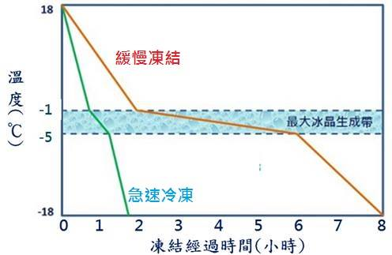

# 酵母

**最佳活動範圍**

*   30度以上雜菌較為活躍，不適合接種酵母
*   投入大量酵母形成優勢菌種可以壓制雜菌
*   可以事先對酵母進行擴培增加酵母數量（充氧）
*   即便單純的喚醒（泡水、最好泡麥汁一兩個小時）也有助於酵母的活力
*   醋酸菌只有在有氧環境下增殖
*   ph低於4時酵母不活動  
    *部分果汁酸度很高，使用前請先量過*  
    *可以考慮加入糖水降低酸度再發酵*

有的說法是以菌數為準，但也有說法是酵母的活力也很重要

**酵母自溶**

雖說會造成很恐怖的味道，但實際上是怎麼樣呢？或許很多時候我們把醬味或是一些其他問題風味搞混在一起了。  
田大表示味道就像煮美式熱狗剩下的水一樣

但要避免自溶本身並不容易，或許比較好的做法是轉桶與充分冷降，盡量讓酵母的數量變少來避免死酵母帶進酒中

[酵母自溶的條件](https://www.facebook.com/groups/homebrew.tw/permalink/1580857711931531/?comment_id=1581273685223267&notif_t=group_comment_reply&notif_id=1485942032681742)

**擴培與菌種純化教材**

[許振翊](https://www.facebook.com/firebear1994)
[https://www.facebook.com/groups/homebrew.tw/1470968762920427/](https://www.facebook.com/groups/homebrew.tw/1470968762920427/)

**無菌操作**

雖然很難弄到無菌操作台，但酒精燈可以做到類似效果

https://www.ptt.cc/bbs/Biotech/M.1096986708.A.9AD.html

## Pitch Rate

每公升麥汁所應下的酵母數量

酵母不夠會有許多副作用

*   殘糖吃不完
*   發酵太慢
*   中間產物過多走味
*   在形成優勢菌種前被雜菌感染

酵母過多的副作用

*   酵母味過重？

計算機

[http://www.brewersfriend.com/yeast-pitch-rate-and-starter-calculator/](http://www.brewersfriend.com/yeast-pitch-rate-and-starter-calculator/)

## 擴培

目的是最短時間達成優勢菌種，所以分三階段，每個階段都是優勢菌種避免雜菌進入

每個階段3日，總共耗時9天

第一段擴培 100ml試管 20ml麥汁

第二段擴培 醬菜瓶 1/4～1/5麥汁

第三段擴培 1500ml瓶 300ml麥汁 

使用：第三段一瓶對上7L麥汁，可使用多瓶

**工具**

酒精燈、接種環(loop)、矽膠頭滴管、鋁箔紙、100ml有蓋玻璃管數個、醬菜瓶數個、1500ml瓶數個

**材料**

崇德發白麥汁

**準備**

(1) 在玻璃管內裝入約 20ml 左右麥汁，蓋上管蓋(勿鎖緊)，滅菌冷卻後鎖緊管蓋 

(2) 桌面擦拭清潔，旁邊盡量不要擺東西，不要吹電風扇，不要位於冷氣出風口， 操作過程勿講話，能戴口罩更好，雙手洗乾淨 

(3) 點燃酒精燈，觀察火焰有無明顯晃動，若有，代表氣流太混亂，可能影響無 菌區域 

**流程**

(4) 將接種環燒紅後，移至酒精燈無菌區域下自然冷卻 

(5) 在無菌區域下打開酵母，將冷卻後的接種環沾一點酵母，再將接種環置入新 的培養液稍微晃動一下 

(6) 培養管置室溫培養約 3 日，中途可手動搖晃數次，三日後應可見底部有明顯 酵母沉澱 

(7) 將管蓋鎖緊，置 4℃冰箱可保存 2 個月；或是直接進行中量及大量培養

**轉大批量**

(1) 小量培養後靜置使酵母沉澱，**倒去大部分液體**，搖晃使沉澱的酵母懸浮後， 倒入中量培養瓶，蓋子勿鎖緊 

(2) 培養 2~3 日後，重複上述步驟倒入大量培養瓶 

(3) 培養後的酵母約可以使用在 7L 的 batch size，如果 batch size 更大則多養幾瓶(效果絕對比養更大體積的一瓶好)，培養的效果及活性因環境及操作手法 而異，建議每次操作都要記錄，再微調出最適合的方法

## 菌種純化

**工具**

酒精燈、接種環(loop)、矽膠頭滴管、鋁箔紙、100ml有蓋玻璃管數個

**材料**

崇德發白麥汁、洋菜粉

**流程**

製作[斜面培養基](https://www.google.com.tw/webhp?sourceid=chrome-instant&ion=1&espv=2&ie=UTF-8#q=%E6%96%9C%E9%9D%A2%E5%9F%B9%E9%A4%8A%E5%9F%BA) 洋菜2%加入麥汁後傾斜倒入試管等待凝固

用loop沾取菌種從底部迂迴畫到頂部

等待1-4日長出肉眼可見叢集後沾取單一菌落到第一段擴培培養

## 採取天然酵母

http://caroleasylife.blogspot.com/2009/05/blog-post_11.html

## 酵母回收與保存

**線上教材**

中文影片 http://bbs.homebrew8.com/forum.php?mod=viewthread&tid=792&extra=page%3D1&page=1&&_dsign=c19dd68e

**回收酵母的理由**

*   省錢
*   想要留存某次釀造的意外好成果
*   不好取得的特殊菌株
*   自行培育的菌株（天然野生酵母之類）

**缺點**

回收酵母會一代比一代衰弱，除非經過特殊培養篩選

有的說法是回收一次即可，也有的說法是可以回收三次

專家說法：

[Zachccy Chen](https://www.facebook.com/zachccy.chen)

避免擴陪與回收酵母，家釀不容易控制微生物，不需增加變數

我們600L發酵罐都不回收了，家釀也真的不需要回收

## 回收方法

**從啤酒中回收**

*   要注意，回收酵母一般來說數量不夠，使用前記得擴培

最好的作法是從高泡期直接取上層酒液，那會是有活力的新鮮酵母，但是酵母密度可能較差

有增加感染的風險，但是對於熟練的釀酒師來說不是大問題

**直接用酵母泥釀下一批**

https://www.facebook.com/groups/homebrew.tw/permalink/1429387793745191/

會有風味干擾的問題，也要小心感染

OG高於1.06的不建議這麼使用

[Vito Tai ](https://www.facebook.com/vito.tai?fref=ufi) 如果OG一樣的話，酵母量會太高，酵母前期生長產生的某些產物（忘了什麼了）會偏低，味道可能會比較單調。也有人是利用這種方法先釀低OG，再釀高OG的，省掉釀高OG時需要多次擴培。這是我在網路上查到資訊，小弟沒有實際嘗試過。

[許家維](https://www.facebook.com/profile.php?id=100000297023222&fref=ufi)  發酵完底下的泥不只有酵母(死的活的都有)，還有一些蛋白質哩哩扣扣的，對風味有影響

酵母量一定夠多甚至太多

[李官達](https://www.facebook.com/jason.li.7796?fref=ufi)  國外還蠻多人這樣做的，為的是省酵母錢或是特殊酵母，只是OG高過1.060的酒就不建議使用這方法，風味的改變聽說有好有壞，有看過在一定批次內，越釀越好喝的

[Vincent PC Chan](https://www.facebook.com/profile.php?id=100000052055550)  個人常用這種方式進行發酵，試過多次沒有問題。這個方法也是台灣北部某釀酒廠的老前輩教我的。

把前一批酒裝完後（留意儘量不要接觸太多空氣），倒掉 3／4 至 4／5（對，只留 1／4 到 1／5），然後把下一批麥汁直接倒入開始發酵。很快就會開始起酵了！

在這一天，需要磨麥、糖化（同時裝瓶、喝酒）、煮酒花（同時裝瓶、喝酒）、冷卻（繼續裝瓶、喝酒），然後再把酵母處理好準備發酵工作。當然，還要清洗鍋子和桶子（繼續喝酒）。會是非常忙碌的一天！

**從酵母泥回收**

[https://www.facebook.com/groups/homebrew.tw/permalink/1415929045091066/](https://www.facebook.com/groups/homebrew.tw/permalink/1415929045091066/)

[https://youtu.be/XL0NUR5tTNE](https://youtu.be/XL0NUR5tTNE)

[Robin Wang ](https://www.facebook.com/robin.wang168?fref=nf) 

蠻清楚的回收酵母流程，資料庫以前有圖，後來圖好像不見了，補個影片給大家看。

1、加入煮沸過的冷開水 (冷的喔，熱的酵母會 GG)

2、等待沉澱分層，最下面的沉澱不用，那些是死酵母和一些沉澱的渣.....等等，只倒出中間那層到消毒過的瓶子 (我用過很多種瓶子，血清瓶最好用)，盡量倒滿，不要留空氣。

3、可以等他再澄清一下，重覆 2。

4、取到夠用的數量就可以了，轉緊瓶蓋，放入冷藏，學長說不要放冰箱門上。

5、前三天可能還會有氣，必要時拿出來轉鬆一下瓶蓋放氣，不要開蓋，轉鬆就可以馬上再轉緊。

每一瓶裡面的酵母數量其實不夠釀一批，雷大書有教，pitching rate 太低的話，酒會有很多問題，所以要釀前就要先擴培，一次用一瓶，如果你回收了 3 瓶，就可以再釀三次。

我習慣用回收酵母釀的酒就不再回收，因為上次葉奕辰上課時有說過我們這樣回收的方式其實就是業餘的玩法，主要只是省錢而已，酵母沒有經過篩選和不是無菌的流程下回收，若一代代一直回收下去，缺點會被放大，所以建議只回收一代就好，不過回收個三瓶就可以再玩三次，已經夠本了。

Robin Wang 其實我覺得在發酵桶內沉澱那步驟很多餘，因為桶子太大，等你沉澱好拿起來倒就又濁了。

所以我都加開水搖一搖就直接先倒到我娘的豆腐乳玻璃罐(大約5L那種桃太郎罐子)，等分層就用大針筒抽中間那層，裝到150ml的血清瓶，裝滿三瓶就收工，剩下倒掉。

影片說法

[https://youtu.be/XL0NUR5tTNE](https://youtu.be/XL0NUR5tTNE)

主發酵結束後會留下酵母泥，酵母泥主要組成為 啤酒、酵母、死酵母、麥渣等殘渣

要注意：此種回收法多少會讓味道交互混到，請盡量使用在相同類型的酒中

*   準備三個可以密封的玻璃容器，1Lx1+0.5Lx2
*   泡水煮沸消毒，消毒後承裝裡面的水密封後放涼備用
*   把1L的水倒入釀造後留下的酵母泥，並充分搖晃後靜置沈澱
*   把酵母泥倒回1L罐，靜置沈澱到分成三層
*   上層為啤酒、中層為酵母、下層為殘渣
*   把上層的啤酒倒掉，取中層的酵母
*   根據需要重複清洗動作，不過也別洗太多次，增加感染風險
*   最後將酵母裝罐後冷藏

## 短期保存

放置於冷藏，可保存1-8週（不一定）

請不要放在會忽冷忽熱的地方（如冰箱門上），會降低酵母的品質與壽命

## 長期保存

**冷凍**

http://www.homebrewtalk.com/freezing-yeast.html

https://www.facebook.com/groups/homebrew.tw/permalink/1415929045091066/

[https://www.facebook.com/groups/homebrew.tw/1470968762920427/](https://www.facebook.com/groups/homebrew.tw/1470968762920427/)

https://www.facebook.com/groups/homebrew.tw/permalink/1465240553493248/

**‎[林洺呈](https://www.facebook.com/mclin0418?hc_ref=NEWSFEED&fref=nf)‎  **[分享] 酵母凍乾注意事項。

以下資訊有點硬，紀錄一下順便分享給其他感興趣的朋友。

酵母的細胞較其他乳酸菌的細胞大顆，凍乾過程常常會因為細胞內部的水形成冰晶而把細胞弄破，前輩建議，在凍乾前加點甘油，不要使用 -20 度凍乾，要更冷的方式凍乾(-40~-50)，最好建議直接滴入液態氮，再送進真空艙乾燥。以上方法凍乾酵母存活率高。

**<u>[Stan Huang](https://www.facebook.com/wwfwfe?fref=ufi)</u>** 能夠越快通過最大冰晶生成帶(-1~-5度)的話 可以讓冰晶生成越小顆 對細胞的傷害會比較小

**[許振翊](https://www.facebook.com/firebear1994?fref=ufi)** 我們在實驗室冷凍保存細胞的時候，是使用20%DMSO(一種有機溶劑)，然後以每分鐘約1度的速率降溫至-80度後，再移至液態氮桶永久保存。如果是凍細菌(例如大腸桿菌)或酵母菌，則是將菌種於適合的培養液中培養至一定的量之後，直接將菌液與無菌甘油混合(混合後甘油最終濃度為15%)，之後直接放入-20度保存可以放10年甚至更久(當然要放-80也OK)。加甘油跟DMSO的原理就如上面幾位學長提到的是為了讓細胞脫水，因為冷凍過程會產生冰晶而刺破細胞。但是關於需不需要急速冷凍的話我的見解比較不一樣，通常需要將細胞直接丟入液態氮急速冷凍是為了將細菌細胞保持在當下的那個狀態(例如做comptent cell的時候就會用液態氮急速冷凍)，但是其實急速冷凍會造成細胞比較沒脫水脫得這麼完全，所以如果是為了"保存"菌種，目的是能盡量讓所有細胞都活下來，所以這時應該是要緩慢降溫讓細菌有足夠時間脫水以避免產生冰晶。最後再分享一件事，就是**通常細菌(或真菌)因為有細胞壁，所以其實很好養也很好凍，所以真的不用太嚴肅看待，就是用15%無菌甘油直接丟冷凍庫就好了**，雖然家用冷凍庫的溫度可能連-20都不到，不過以一位狂熱份子來說應該不會把酵母丟冷凍庫這麼久而都不去用她吧XD
<undefined><li>**抗凍劑**</li></undefined>

加甘油

[Vito Tai](https://www.facebook.com/vito.tai?fref=ufi)  我之前有分享過，也有朋友分享脫脂奶粉和海藻糖的方法；我目前是是甘油，還沒試過海藻糖，不過google大神的意思也是認為海藻糖加脫脂奶粉不錯。

**[Shauhong Wei](https://www.facebook.com/shauhong.wei?fref=ufi)** 解凍的酵母要經過擴培，可以用離心機分離甘油

**[許振翊](https://www.facebook.com/firebear1994?fref=ufi)** 甘油是丙三醇，基本生物體(包括人)上代謝醣類的中間產物就是甘油，所以應該不用特別在意
<undefined><li>**保存期限**</li></undefined>

[Vito Tai ](https://www.facebook.com/vito.tai?fref=ufi) 如果酵母從奶油色變成花生醬的顏色，應該就不太能用了。放多久跟保存狀況有很大關係；我本來用一台舊冰箱，最久有放到三個月的（我還很嫩，沒有太久的記錄），後來換了一台新的冰箱，反而很快就變色了。也因為冰箱空間的問題，我現在都改用"冷凍"保存，只要加一點防凍劑，結凍和解凍時注意一下，也不太難。目前最久有解凍兩個月前冰的，感覺和冷藏二個星期到1個月的活力差不多。